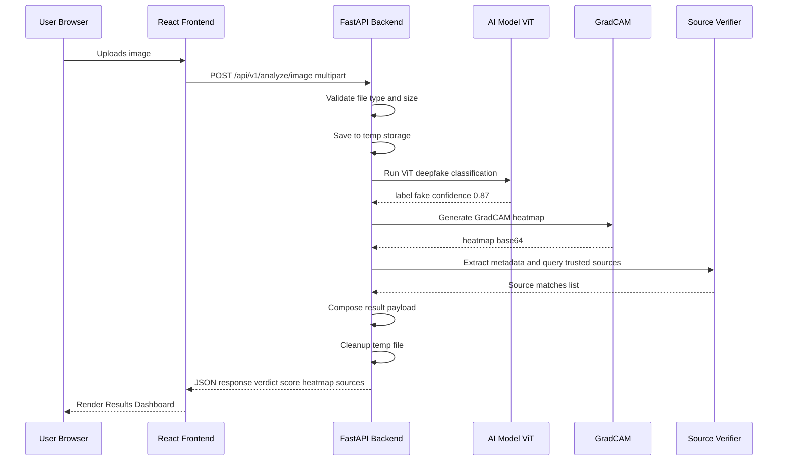
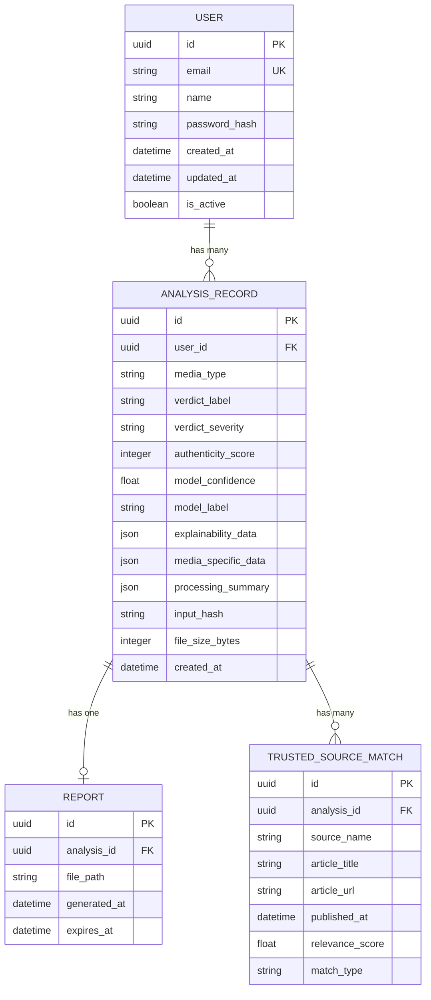
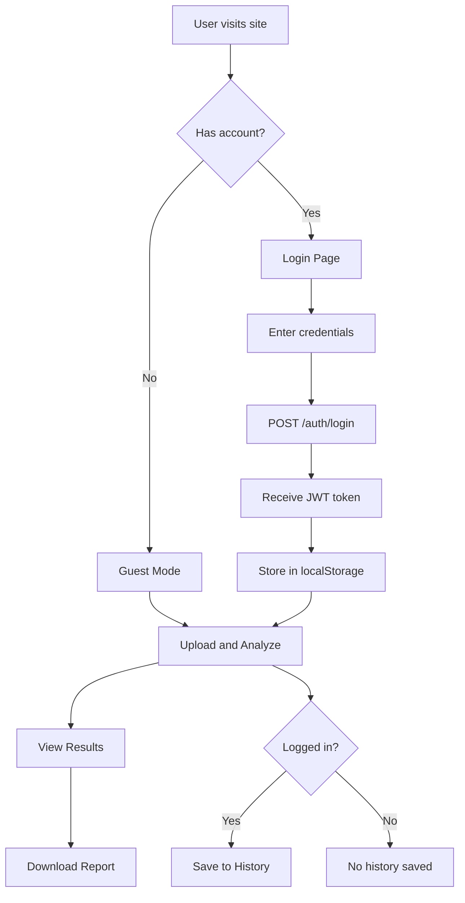

# DeepShield — Ultimate Build Plan

> **Derived from:** [prd.md](file:///c:/Users/athar/Desktop/minor2/prd.md)
> **Version:** 1.0
> **Date:** 2026-04-14
> **Status:** In Progress — Phase 3 backend scaffolded (text + news lookup); frontend + smoke test pending
>
> **Build Log:**
> - 2026-04-15 — Phase 2.1 face-gating. Video pipeline now runs MediaPipe FaceMesh per sampled frame; only face-containing frames contribute to `mean/max suspicious_prob` and `suspicious_ratio`. `MIN_FACE_FRAMES = 3`; below that, verdict becomes **"Insufficient face content"** (severity warning, score 50) instead of a spurious deepfake label. Schema adds `num_face_frames`, `insufficient_faces`, per-frame `has_face` / `scored`. Frontend `FrameTimeline` dims/greys no-face frames with a pill tag; `AnalyzePage` shows an amber "insufficient faces" banner. Addresses model bias: `prithivMLmods/Deep-Fake-Detector-v2-Model` is face-centric and over-predicts "Deepfake" on scenic/no-face content.
> - 2026-04-15 — Phase 3 backend started. `services/text_service.py` (HF BERT fake-news pipeline via `GonzaloA/fake-news-detection-small`, `fake_prob` via label scan + `extract_keywords` frequency-based). `services/news_lookup.py` (newsdata.io, trusted-domain allowlist → relevance boost). Added `httpx==0.27.2`. Schemas: `TextExplainability`, `TextAnalysisResponse`. `POST /api/v1/analyze/text` accepts JSON `{text}`, returns verdict + keywords + trusted sources (empty if `NEWS_API_KEY` unset); persists `AnalysisRecord`.
> - 2026-04-15 — Phase 2 complete (video pipeline); ready for browser verification → Phase 3
>
> **Build Log:**
> - 2026-04-15 — Phase 2 done. Video detection pipeline: `services/video_service.py` (OpenCV uniform frame sampling, 16 frames default; per-frame ViT classification reusing `classify_image`; aggregation → mean/max suspicious prob, suspicious ratio, timestamps). Added `save_upload_to_tempfile` streaming helper in `utils/file_handler.py` (1 MB chunks, size-capped). `POST /api/v1/analyze/video` endpoint registered; maps `1 − mean_suspicious_prob` through the trust scale and persists an `AnalysisRecord`. Frontend: UploadZone now accepts `mediaType="video"` (MP4/WebM/MOV/AVI) with a `<video>` preview; new `FrameTimeline` component renders a colored strip along time axis + per-frame cards; `AnalyzePage` got an Image/Video tab switcher and video result layout (timeline + playback). curl smoke: 16-frame synthetic MP4 → HTTP 200 in ~5.5s, verdict "Possibly Manipulated" (mean 0.584).
> - 2026-04-15 — Phase 1.6–1.7 done. Built full image-analysis UI: `services/api.js` (axios, 120s timeout, error interceptor), `services/analyzeApi.js`, `utils/constants.js` (severity colors + linear score→RGB interp). Components: `UploadZone` (react-dropzone, MIME+size validation, thumbnail), `ScoreMeter` (animated 270° SVG arc), `VerdictCard`, `HeatmapOverlay` (side-by-side + opacity slider), `IndicatorCards` (severity pills), `ProcessingSummary` (collapsible), `ResponsibleAIBanner`, `LoadingSpinner`. `AnalyzePage.jsx` wires full flow: upload → POST /analyze/image → render dashboard. Backend (:8000) + frontend (:5173) both returning HTTP 200. Browser verification pending.
> - 2026-04-14 — Phase 0 started. Backend scaffolded (FastAPI + config + SQLAlchemy models + `/health`). Python 3.11 venv at `backend/.venv`. Core deps installed. `/api/v1/health` verified.
> - 2026-04-14 — Phase 0 finished. Frontend Vite+React 18+Router scaffolded. Design tokens (`index.css`) per §6.1. Navbar/Footer + placeholder pages for all routes (`/`, `/analyze`, `/results/:id`, `/history`, `/login`, `/register`, `/about`, 404). `npm install` clean (135 pkgs). Dev server boots on :5173 (HTTP 200). Vite proxies `/api` → backend :8000.
> - 2026-04-14 — Phase 1 started. AI deps installed: torch 2.4.1+cpu, torchvision 0.19.1+cpu, transformers 4.44.2, opencv-python 4.10, grad-cam 1.5.4, pillow, numpy, scipy. Model loader singleton built (`backend/models/model_loader.py`) with lazy init for image/text/OCR/face models; wired into FastAPI lifespan with `PRELOAD_MODELS` env flag. Import smoke test passed.
> - 2026-04-15 — Phase 1.5 done. Built `api/v1/analyze.py` with `POST /api/v1/analyze/image` (multipart, field `file`). Orchestrates validate → classify → scan_artifacts → heatmap → `ImageAnalysisResponse`, persists an `AnalysisRecord` row (heatmap excluded from stored JSON). Registered in `api/router.py`. curl verified HTTP 200 in ~4.8s end-to-end on a 30 KB JPEG; DB row id=1 persisted. Fixed pydantic `protected_namespaces=()` on Verdict/ProcessingSummary to silence `model_*` field warnings.
> - 2026-04-15 — Phase 1.4 done. Built `services/artifact_detector.py` with four deterministic signals: (1) GAN/diffusion HF artifact via FFT high-freq ratio, (2) JPEG Q-table anomaly via PIL `img.quantization`, (3) MediaPipe FaceMesh jaw-contour jitter, (4) per-quadrant luminance imbalance. Added MediaPipe 0.10.14. Smoke output on Picsum: GAN_HF=MEDIUM(0.67), compression=LOW(0.00). No face in sample → no facial/lighting indicators (expected).
> - 2026-04-15 — Phase 1.3 done. Built `models/heatmap_generator.py` with `_HFLogitsWrapper` (Grad-CAM needs tensor output, HF returns `ImageClassifierOutput`), `_vit_reshape_transform` (drop CLS token, reshape 196 tokens → 14×14 grid), target layer = `model.vit.encoder.layer[-1].layernorm_before`. Returns `data:image/png;base64,…` data URL. Smoke test saved `backend/heatmap_smoketest.png` (224×224, ~51 KB).
> - 2026-04-14 — Phase 1.2 done. Built `services/image_service.py` (classify_image via ViT), `schemas/common.py` + `schemas/analyze.py` (Verdict, ArtifactIndicator, etc.), `utils/scoring.py` (TRUST_SCALE, authenticity score, verdict labels, color interp), `utils/file_handler.py` (MIME+size+magic-byte validation). Model id2label is `{0:Realism, 1:Deepfake}`. Smoke script `scripts/test_image_classify.py` passes: random Picsum image → Deepfake @ 0.508 → score 49 → "Possibly Manipulated". First-run model download cached to `~/.cache/huggingface/`.

---

## Table of Contents

1. [Executive Summary](#1-executive-summary)
2. [System Architecture](#2-system-architecture)
3. [Technology Stack](#3-technology-stack)
4. [Directory & File Structure](#4-directory--file-structure)
5. [Backend — Module-by-Module Specification](#5-backend--module-by-module-specification)
6. [Frontend — Component Hierarchy & Design System](#6-frontend--component-hierarchy--design-system)
7. [AI Models & Inference Pipeline](#7-ai-models--inference-pipeline)
8. [API Contract — Endpoint Specifications](#8-api-contract--endpoint-specifications)
9. [Database Schema](#9-database-schema)
10. [Trusted Source Verification System](#10-trusted-source-verification-system)
11. [PDF Report Generation](#11-pdf-report-generation)
12. [Authentication & User Accounts](#12-authentication--user-accounts)
13. [Security Architecture](#13-security-architecture)
14. [Performance Optimization](#14-performance-optimization)
15. [Testing Strategy](#15-testing-strategy)
16. [Deployment & DevOps](#16-deployment--devops)
17. [Phased Development Timeline](#17-phased-development-timeline)
18. [Risk Register & Mitigation](#18-risk-register--mitigation)
19. [Definition of Done](#19-definition-of-done)
20. [Datasets & Testing Resources](#20-datasets--testing-resources)

---

## 1. Executive Summary

DeepShield is an **Explainable AI-based multimodal misinformation detection web platform** that accepts images, videos, news text, and social media screenshots — then returns transparency-backed authenticity verdicts with evidence signals, heatmaps, confidence scores, trusted-source cross-referencing, and downloadable PDF reports.

### Goals of This Build Plan

| Goal | Description |
|:-----|:------------|
| **Functional completeness** | Every PRD feature mapped to a concrete implementation task |
| **Architectural clarity** | Clear separation of frontend, API, inference, and storage layers |
| **Model specificity** | Exact Hugging Face model IDs, fallbacks, and integration code patterns |
| **Reproducibility** | Any developer can set up and run the project from this document alone |
| **Academic readiness** | Structured for college minor project submission and viva defense |

---

## 2. System Architecture

### 2.1 High-Level Architecture Diagram

```
┌─────────────────────────────────────────────────────────────────────┐
│                        CLIENT (Browser)                             │
│  ┌───────────────────────────────────────────────────────────────┐  │
│  │              React + Vite SPA (Material Design)               │  │
│  │  ┌──────────┐ ┌───────────┐ ┌──────────┐ ┌───────────────┐  │  │
│  │  │  Upload   │ │ Pipeline  │ │ Results  │ │   Reports     │  │  │
│  │  │  Module   │ │ Animation │ │Dashboard │ │   & History   │  │  │
│  │  └──────────┘ └───────────┘ └──────────┘ └───────────────┘  │  │
│  └───────────────────────────────────────────────────────────────┘  │
│                              │  HTTPS / REST                        │
└──────────────────────────────┼──────────────────────────────────────┘
                               │
┌──────────────────────────────┼──────────────────────────────────────┐
│                     BACKEND (FastAPI Server)                        │
│  ┌───────────────────────────┼───────────────────────────────────┐  │
│  │                    API Gateway Layer                           │  │
│  │  ┌──────────┐ ┌──────────┐ ┌────────────┐ ┌──────────────┐  │  │
│  │  │  /upload  │ │ /analyze │ │  /report   │ │   /auth      │  │  │
│  │  └──────────┘ └──────────┘ └────────────┘ └──────────────┘  │  │
│  ├───────────────────────────────────────────────────────────────┤  │
│  │                   Service Layer                               │  │
│  │  ┌──────────────┐ ┌──────────────┐ ┌──────────────────────┐  │  │
│  │  │ Image Service │ │Video Service │ │  Text Service        │  │  │
│  │  └──────────────┘ └──────────────┘ └──────────────────────┘  │  │
│  │  ┌──────────────┐ ┌──────────────┐ ┌──────────────────────┐  │  │
│  │  │Screenshot Svc│ │ Source Svc   │ │  Report Generator    │  │  │
│  │  └──────────────┘ └──────────────┘ └──────────────────────┘  │  │
│  ├───────────────────────────────────────────────────────────────┤  │
│  │                  AI Inference Layer                            │  │
│  │  ┌──────────────┐ ┌──────────────┐ ┌──────────────────────┐  │  │
│  │  │ ViT/SigLIP   │ │  BERT NLP    │ │  EasyOCR Engine      │  │  │
│  │  │ Deepfake Det │ │ Classifier   │ │                      │  │  │
│  │  └──────────────┘ └──────────────┘ └──────────────────────┘  │  │
│  │  ┌──────────────┐ ┌──────────────┐                           │  │
│  │  │  Grad-CAM    │ │  OpenCV      │                           │  │
│  │  │  Explainer   │ │  Preprocessor│                           │  │
│  │  └──────────────┘ └──────────────┘                           │  │
│  ├───────────────────────────────────────────────────────────────┤  │
│  │                  Data / Storage Layer                          │  │
│  │  ┌──────────────┐ ┌──────────────┐ ┌──────────────────────┐  │  │
│  │  │ SQLite DB    │ │  Temp File   │ │  Report PDF Cache    │  │  │
│  │  │ (Users/Hist) │ │  Storage     │ │                      │  │  │
│  │  └──────────────┘ └──────────────┘ └──────────────────────┘  │  │
│  └───────────────────────────────────────────────────────────────┘  │
└─────────────────────────────────────────────────────────────────────┘
```

### 2.2 Request Lifecycle (Image Example)



### 2.3 Architectural Principles

| Principle | Implementation |
|:----------|:---------------|
| **Separation of Concerns** | Routes → Services → Models → Storage are distinct layers |
| **Stateless API** | No server-side session state; JWT tokens for auth |
| **Fail-safe inference** | Every model call wrapped in try/except with graceful fallback |
| **Temporary storage** | Uploaded media deleted after analysis (configurable retention) |
| **Monorepo structure** | Single repo with `/frontend` and `/backend` directories |

---

## 3. Technology Stack

### 3.1 Frontend

| Technology | Version | Purpose | Rationale |
|:-----------|:--------|:--------|:----------|
| **React** | 18.x | UI framework | Component-based, massive ecosystem |
| **Vite** | 5.x | Build tool | Fast HMR, native ESM support |
| **React Router** | 6.x | Client routing | SPA navigation |
| **Axios** | 1.x | HTTP client | Interceptors, cancel tokens for uploads |
| **Framer Motion** | 11.x | Animations | Pipeline stage animations, micro-interactions |
| **Recharts** | 2.x | Charts | Confidence timelines, score meters |
| **React Dropzone** | 14.x | File upload | Drag-and-drop with validation |
| **CSS Modules** | — | Styling | Scoped styles, Material Design tokens |
| **Google Fonts Inter** | — | Typography | Clean, modern, highly readable |

### 3.2 Backend

| Technology | Version | Purpose | Rationale |
|:-----------|:--------|:--------|:----------|
| **Python** | 3.10+ | Runtime | Model ecosystem compatibility |
| **FastAPI** | 0.110+ | Web framework | Async, auto-docs, Pydantic validation |
| **Uvicorn** | 0.29+ | ASGI server | Production-grade async server |
| **Pydantic** | 2.x | Data validation | Request/response schemas |
| **python-multipart** | 0.0.9+ | File uploads | Multipart form data parsing |
| **SQLAlchemy** | 2.x | ORM | Database abstraction |
| **SQLite** | 3.x | Database | Zero-config, file-based, perfect for college project |
| **Alembic** | 1.x | Migrations | Schema versioning |
| **python-jose** | 3.x | JWT tokens | Authentication |
| **passlib bcrypt** | 1.7+ | Password hashing | Secure credential storage |

### 3.3 AI / ML Stack

| Technology | Version | Purpose | Rationale |
|:-----------|:--------|:--------|:----------|
| **PyTorch** | 2.x | Deep learning framework | Model runtime |
| **Transformers HuggingFace** | 4.40+ | Model loading and inference | Pretrained pipeline access |
| **Pillow PIL** | 10.x | Image processing | Resize, format conversion |
| **OpenCV cv2** | 4.9+ | Video processing | Frame extraction, preprocessing |
| **pytorch-grad-cam** | 1.5+ | Explainability | Heatmap generation |
| **EasyOCR** | 1.7+ | OCR extraction | Screenshot text extraction |
| **MediaPipe** | 0.10+ | Face detection | Facial landmark tracking for video |

### 3.4 Utilities and Infrastructure

| Technology | Purpose |
|:-----------|:--------|
| **WeasyPrint** | PDF report generation via HTML/CSS to PDF |
| **Jinja2** | HTML templating for PDF reports |
| **NewsData.io API** | Trusted Indian news source querying |
| **python-dotenv** | Environment variable management |
| **Loguru** | Structured logging |
| **Docker** | Containerization for optional deployment |
| **pytest** | Backend testing |
| **Vitest** | Frontend testing |

---

## 4. Directory and File Structure

### 4.1 Root Structure

```
minor2/
├── prd.md                          # Product Requirements Document
├── BUILD_PLAN.md                   # This file
├── README.md                       # Project overview and setup guide
├── docker-compose.yml              # Optional multi-container setup
├── .env.example                    # Environment variable template
├── .gitignore
│
├── backend/                        # Python FastAPI backend
│   ├── main.py                     # Application entry point
│   ├── config.py                   # Configuration and env loading
│   ├── requirements.txt            # Python dependencies
│   ├── Dockerfile                  # Backend container
│   │
│   ├── api/                        # API route layer
│   │   ├── __init__.py
│   │   ├── router.py               # Main API router aggregator
│   │   ├── v1/
│   │   │   ├── __init__.py
│   │   │   ├── analyze.py          # /analyze endpoints for all media types
│   │   │   ├── report.py           # /report endpoints generate and download
│   │   │   ├── auth.py             # /auth endpoints register login me
│   │   │   ├── history.py          # /history endpoints list and detail
│   │   │   └── health.py           # /health endpoint
│   │
│   ├── schemas/                    # Pydantic request/response models
│   │   ├── __init__.py
│   │   ├── analyze.py              # AnalyzeImageRequest AnalyzeResponse etc
│   │   ├── report.py               # ReportRequest ReportResponse
│   │   ├── auth.py                 # RegisterRequest LoginRequest TokenResponse
│   │   └── common.py               # Shared schemas ConfidenceScore Verdict etc
│   │
│   ├── services/                   # Business logic layer
│   │   ├── __init__.py
│   │   ├── image_service.py        # Image deepfake detection orchestration
│   │   ├── video_service.py        # Video analysis orchestration
│   │   ├── text_service.py         # Fake news text analysis
│   │   ├── screenshot_service.py   # Screenshot OCR plus credibility analysis
│   │   ├── source_service.py       # Trusted source verification
│   │   ├── report_service.py       # PDF report generation
│   │   ├── auth_service.py         # Authentication logic
│   │   └── history_service.py      # Analysis history management
│   │
│   ├── models/                     # AI model loading and inference
│   │   ├── __init__.py
│   │   ├── model_loader.py         # Singleton model loader loads once at startup
│   │   ├── image_detector.py       # ViT SigLIP deepfake classifier
│   │   ├── video_detector.py       # Frame level analysis plus aggregation
│   │   ├── text_classifier.py      # BERT fake news classifier
│   │   ├── ocr_engine.py           # EasyOCR wrapper
│   │   ├── heatmap_generator.py    # GradCAM heatmap generation
│   │   └── face_detector.py        # MediaPipe face detection
│   │
│   ├── db/                         # Database layer
│   │   ├── __init__.py
│   │   ├── database.py             # SQLAlchemy engine and session
│   │   ├── models.py               # ORM models User AnalysisRecord Report
│   │   └── migrations/             # Alembic migrations
│   │       ├── env.py
│   │       └── versions/
│   │
│   ├── utils/                      # Utility functions
│   │   ├── __init__.py
│   │   ├── file_handler.py         # Temp file save delete validation
│   │   ├── image_utils.py          # Resize normalize format conversion
│   │   ├── video_utils.py          # Frame extraction keyframe selection
│   │   ├── text_utils.py           # Text preprocessing keyword extraction
│   │   └── scoring.py              # Score normalization verdict mapping
│   │
│   ├── templates/                  # Jinja2 HTML templates
│   │   └── report_template.html    # PDF report HTML template
│   │
│   ├── static/                     # Static assets for reports
│   │   ├── report_logo.png
│   │   └── report_styles.css
│   │
│   └── tests/                      # Backend tests
│       ├── __init__.py
│       ├── conftest.py             # Fixtures test client mock models
│       ├── test_analyze.py
│       ├── test_report.py
│       ├── test_auth.py
│       ├── test_image_detector.py
│       ├── test_text_classifier.py
│       └── test_utils.py
│
├── frontend/                       # React Vite frontend
│   ├── package.json
│   ├── vite.config.js
│   ├── index.html                  # SPA entry point
│   ├── Dockerfile                  # Frontend container
│   │
│   ├── public/
│   │   ├── favicon.ico
│   │   ├── logo.svg
│   │   └── og-image.png            # Open Graph preview
│   │
│   └── src/
│       ├── main.jsx                # React root mount
│       ├── App.jsx                 # Root component plus router
│       ├── index.css               # Global styles and design tokens
│       │
│       ├── assets/                 # Static assets images icons
│       │   ├── deepshield-logo.svg
│       │   ├── hero-illustration.svg
│       │   └── icons/
│       │       ├── upload.svg
│       │       ├── shield-check.svg
│       │       ├── document.svg
│       │       └── user.svg
│       │
│       ├── components/             # Reusable UI components
│       │   ├── layout/
│       │   │   ├── Navbar.jsx
│       │   │   ├── Navbar.module.css
│       │   │   ├── Footer.jsx
│       │   │   ├── Footer.module.css
│       │   │   ├── PageContainer.jsx
│       │   │   └── PageContainer.module.css
│       │   │
│       │   ├── upload/
│       │   │   ├── UploadZone.jsx          # Drag and drop upload area
│       │   │   ├── UploadZone.module.css
│       │   │   ├── MediaTypeSelector.jsx   # Image Video Text Screenshot tabs
│       │   │   ├── MediaTypeSelector.module.css
│       │   │   ├── TextInput.jsx           # Article text paste area
│       │   │   └── TextInput.module.css
│       │   │
│       │   ├── pipeline/
│       │   │   ├── PipelineVisualizer.jsx  # Animated processing stages
│       │   │   ├── PipelineVisualizer.module.css
│       │   │   ├── PipelineStage.jsx       # Individual stage item
│       │   │   └── PipelineStage.module.css
│       │   │
│       │   ├── results/
│       │   │   ├── VerdictCard.jsx          # Main verdict display
│       │   │   ├── VerdictCard.module.css
│       │   │   ├── ScoreMeter.jsx           # Animated gauge 0 to 100
│       │   │   ├── ScoreMeter.module.css
│       │   │   ├── TrustScale.jsx           # Color coded trust bar
│       │   │   ├── TrustScale.module.css
│       │   │   ├── HeatmapOverlay.jsx       # Image manipulation heatmap
│       │   │   ├── HeatmapOverlay.module.css
│       │   │   ├── FrameTimeline.jsx        # Video frame confidence chart
│       │   │   ├── FrameTimeline.module.css
│       │   │   ├── TextHighlighter.jsx      # Suspicious phrase highlighting
│       │   │   ├── TextHighlighter.module.css
│       │   │   ├── IndicatorCards.jsx        # Explainability signal cards
│       │   │   ├── IndicatorCards.module.css
│       │   │   ├── ProcessingSummary.jsx     # Pipeline summary
│       │   │   └── ProcessingSummary.module.css
│       │   │
│       │   ├── sources/
│       │   │   ├── SourcePanel.jsx           # Trusted source evidence panel
│       │   │   ├── SourcePanel.module.css
│       │   │   ├── SourceCard.jsx            # Individual source card
│       │   │   ├── SourceCard.module.css
│       │   │   ├── ContradictionPanel.jsx    # Contradicting evidence
│       │   │   └── ContradictionPanel.module.css
│       │   │
│       │   ├── report/
│       │   │   ├── ReportDownload.jsx        # Download PDF button
│       │   │   └── ReportDownload.module.css
│       │   │
│       │   ├── auth/
│       │   │   ├── LoginForm.jsx
│       │   │   ├── LoginForm.module.css
│       │   │   ├── RegisterForm.jsx
│       │   │   └── RegisterForm.module.css
│       │   │
│       │   └── common/
│       │       ├── Button.jsx
│       │       ├── Button.module.css
│       │       ├── Card.jsx
│       │       ├── Card.module.css
│       │       ├── LoadingSpinner.jsx
│       │       ├── Modal.jsx
│       │       ├── Tooltip.jsx
│       │       └── ResponsibleAIBanner.jsx  # Guidance disclaimer
│       │
│       ├── pages/
│       │   ├── HomePage.jsx              # Landing plus upload entry
│       │   ├── HomePage.module.css
│       │   ├── AnalyzePage.jsx            # Upload Pipeline Results
│       │   ├── AnalyzePage.module.css
│       │   ├── ResultsPage.jsx            # Full results dashboard
│       │   ├── ResultsPage.module.css
│       │   ├── HistoryPage.jsx            # Past analyses logged in
│       │   ├── HistoryPage.module.css
│       │   ├── LoginPage.jsx
│       │   ├── RegisterPage.jsx
│       │   ├── AboutPage.jsx              # Project info methodology
│       │   └── NotFoundPage.jsx
│       │
│       ├── hooks/                         # Custom React hooks
│       │   ├── useAnalysis.js             # Analysis submission and polling
│       │   ├── useAuth.js                 # Authentication state
│       │   └── useFileUpload.js           # File validation and upload
│       │
│       ├── services/                      # API client layer
│       │   ├── api.js                     # Axios instance plus interceptors
│       │   ├── analyzeApi.js              # /analyze endpoint calls
│       │   ├── reportApi.js               # /report endpoint calls
│       │   ├── authApi.js                 # /auth endpoint calls
│       │   └── historyApi.js              # /history endpoint calls
│       │
│       ├── context/
│       │   └── AuthContext.jsx            # Auth provider plus context
│       │
│       └── utils/
│           ├── constants.js               # Score ranges colors labels
│           ├── validators.js              # Client side file validation
│           └── formatters.js              # Score formatting date helpers
│
└── docs/                                  # Documentation
    ├── API_REFERENCE.md
    ├── MODEL_CARDS.md                     # Model details and citations
    └── SETUP_GUIDE.md
```

---

## 5. Backend — Module-by-Module Specification

### 5.1 Application Entry Point - main.py

**Responsibilities:**
1. Create FastAPI app instance with metadata (title, description, version)
2. Configure CORS middleware (allow frontend origin)
3. Include all API routers with versioned prefixes
4. Trigger model preloading on startup event
5. Configure static file serving
6. Setup structured logging via Loguru

**Startup sequence:**
1. Load environment variables from `.env`
2. Initialize database connection and run migrations
3. Preload all AI models into memory (singleton pattern)
4. Register API routers
5. Start Uvicorn server

---

### 5.2 Configuration - config.py

```python
# Environment variables to manage:

class Settings(BaseSettings):
    # Server
    APP_HOST: str = "0.0.0.0"
    APP_PORT: int = 8000
    DEBUG: bool = False
    CORS_ORIGINS: list[str] = ["http://localhost:5173"]

    # Database
    DATABASE_URL: str = "sqlite:///./deepshield.db"

    # File Upload
    MAX_UPLOAD_SIZE_MB: int = 100        # Max file size
    UPLOAD_DIR: str = "./temp_uploads"   # Temp storage path
    ALLOWED_IMAGE_TYPES: list = ["image/jpeg", "image/png", "image/webp"]
    ALLOWED_VIDEO_TYPES: list = ["video/mp4", "video/avi", "video/mov", "video/webm"]
    FILE_RETENTION_SECONDS: int = 300    # Auto-delete after 5 min

    # AI Models
    IMAGE_MODEL_ID: str = "prithivMLmods/Deep-Fake-Detector-v2-Model"
    TEXT_MODEL_ID: str = "GonzaloA/fake-news-detection-small"
    DEVICE: str = "cpu"                  # or "cuda"

    # News API
    NEWS_API_KEY: str = ""               # NewsData.io API key
    NEWS_API_BASE_URL: str = "https://newsdata.io/api/1/news"

    # Auth
    JWT_SECRET_KEY: str = "change-me-in-production"
    JWT_ALGORITHM: str = "HS256"
    JWT_EXPIRATION_MINUTES: int = 1440   # 24 hours

    class Config:
        env_file = ".env"
```

---

### 5.3 Image Detection Service - services/image_service.py

**Input:** Uploaded image file (JPEG, PNG, WebP)
**Output:** `ImageAnalysisResult`

#### Processing Pipeline:

```
Step 1: VALIDATE
  - Check file type (MIME plus magic bytes)
  - Check file size (max 20MB)
  - Reject if invalid

Step 2: PREPROCESS
  - Open with PIL
  - Convert to RGB (handle RGBA, grayscale)
  - Resize to model input size (224x224 for ViT)
  - Save original for heatmap overlay
  - Apply torchvision transforms (normalize)

Step 3: CLASSIFY
  - Load ViT model via model_loader singleton
  - Run forward pass
  - Extract logits then softmax then confidence scores
  - Map to label Real or Fake with confidence float

Step 4: GENERATE HEATMAP
  - Use pytorch-grad-cam with target layer = last attention block
  - Generate grayscale heatmap array
  - Normalize to 0 to 255 range
  - Apply colormap (cv2.COLORMAP_JET)
  - Overlay on original image (alpha blend 0.4)
  - Encode overlay as base64 PNG string
  - Return heatmap_base64

Step 5: DETECT ARTIFACTS
  - Analyze compression artifacts (JPEG quantization table inspection)
  - Check for GAN frequency artifacts (spectral analysis optional)
  - Detect facial boundary inconsistencies (if face detected via MediaPipe)
  - Return list of artifact indicators with severity

Step 6: COMPOSE RESULT
  - Combine classification plus heatmap plus artifacts
  - Compute authenticity_score = confidence times 100
  - Map score to verdict_label using trust scale
  - Return ImageAnalysisResult
```

#### Artifact Detection Indicators:

| Indicator | Method | Output |
|:----------|:-------|:-------|
| GAN artifacts | Spectral analysis of high-frequency components | type gan_artifact, severity high |
| Facial boundaries | MediaPipe face mesh check boundary smoothness | type facial_boundary, severity medium |
| Compression anomalies | JPEG quantization table analysis | type compression, severity low |
| Lighting inconsistency | Analyze light direction variance across face regions | type lighting, severity medium |

---

### 5.4 Video Detection Service - services/video_service.py

**Input:** Uploaded video file (MP4, AVI, MOV, WebM)
**Output:** `VideoAnalysisResult`

#### Processing Pipeline:

```
Step 1: VALIDATE
  - Check file type
  - Check file size (max 100MB)
  - Check duration (max 5 minutes for V1)
  - Reject if invalid

Step 2: EXTRACT KEY FRAMES
  - Open video with cv2.VideoCapture
  - Get total frame count and FPS
  - Strategy: Extract 1 frame every N frames (N = total_frames / 20)
  - Minimum: 10 frames, Maximum: 30 frames
  - For each extracted frame:
    - Convert BGR to RGB
    - Detect face with MediaPipe (optional crop to face region)
    - Resize to 224x224
  - Return list of (frame_index, frame_image, timestamp)

Step 3: ANALYZE FRAMES (BATCH)
  - For each key frame:
    - Run ViT deepfake classifier
    - Record frame_index, timestamp, label, confidence
    - Track facial landmark positions (if MediaPipe detected face)
  - Return frame_results list

Step 4: LANDMARK STABILITY ANALYSIS
  - For sequential frames, compute landmark displacement
  - Flag frames where landmark jitter exceeds threshold
  - Add landmark_instability signals to suspicious frames

Step 5: AGGREGATE SIGNALS
  - Compute weighted average confidence across frames
    (weight = 1.0 for face-detected frames, 0.5 for non-face frames)
  - Count suspicious frames (confidence below 0.5)
  - Generate timeline data: timestamp, confidence, is_suspicious per frame
  - Compute final_verdict based on aggregate score

Step 6: IDENTIFY SUSPICIOUS SEGMENTS
  - Group consecutive suspicious frames into segments
  - For each segment: start_time, end_time, avg_confidence
  - Flag segments for UI timeline highlighting

Step 7: COMPOSE RESULT
  - final_verdict, authenticity_score
  - frame_timeline list (for Recharts visualization)
  - suspicious_segments list
  - landmark_stability_score
  - total_frames_analyzed, suspicious_frame_count
```

---

### 5.5 Text Classification Service - services/text_service.py

**Input:** News article text (string, 50 to 10000 characters)
**Output:** `TextAnalysisResult`

#### Processing Pipeline:

```
Step 1: VALIDATE
  - Check text length (min 50, max 10000 chars)
  - Check language (detect using langdetect, support English Hindi)
  - Reject if invalid

Step 2: PREPROCESS
  - Strip HTML tags (if any)
  - Normalize whitespace
  - Remove URLs (but save them for source checking)
  - Truncate to model max length (512 tokens for BERT)

Step 3: CLASSIFY (FAKE NEWS DETECTION)
  - Load BERT fake-news classifier via model_loader
  - Tokenize with model tokenizer
  - Run inference
  - Extract label REAL or FAKE with confidence float
  - Map to credibility_score (0 to 100)

Step 4: SENSATIONALISM ANALYSIS
  - Count exclamation marks, ALL CAPS words, superlatives
  - Detect clickbait patterns (regex-based):
    - "You won't believe..."
    - "BREAKING:", "SHOCKING:", etc.
    - Excessive emotional language
  - Compute sensationalism_score (0 to 100)
  - Classify: Low / Medium / High sensationalism

Step 5: MANIPULATION INDICATOR DETECTION
  - Scan for manipulation linguistic patterns:
    - Unverified claims ("sources say", "allegedly")
    - Emotional manipulation ("outrage", "shocking truth")
    - False authority ("experts confirm", without citation)
  - For each detected pattern:
    - Record pattern_type, matched_text, start_pos, end_pos, severity
  - Return manipulation_indicators list

Step 6: KEYWORD EXTRACTION
  - Extract top 5 keywords using TF-IDF or simple frequency analysis
  - These keywords feed into the Trusted Source Verification system
  - Return keywords list

Step 7: COMPOSE RESULT
  - credibility_classification: Credible or Possibly Misleading or Likely Fake
  - credibility_score (0 to 100)
  - sensationalism_score plus level
  - manipulation_indicators list (with positions for highlighting)
  - keywords list
  - authenticity_score (weighted combination of credibility plus sensationalism)
```

#### BERT Model Details:

| Property | Value |
|:---------|:------|
| **Primary Model** | `GonzaloA/fake-news-detection-small` |
| **Fallback Model** | `hamzab/roberta-fake-news-classification` |
| **Architecture** | BERT-base / RoBERTa |
| **Input** | Tokenized text (max 512 tokens) |
| **Output** | Binary classification (Real / Fake) with confidence |
| **Labels** | 0 FAKE 1 REAL or model-specific mapping |

---

### 5.6 Screenshot Detection Service - services/screenshot_service.py

**Input:** Social media screenshot image (JPEG, PNG)
**Output:** `ScreenshotAnalysisResult`

#### Processing Pipeline:

```
Step 1: VALIDATE
  - Check file type
  - Check file size (max 20MB)
  - Check minimum dimensions (at least 200x200 px)

Step 2: OCR TEXT EXTRACTION
  - Initialize EasyOCR reader (languages: en, hi)
  - Run OCR on full image
  - For each detected text region:
    - Record text, bbox, confidence
    - Filter out low-confidence results (below 0.3)
  - Concatenate all text blocks into full_extracted_text
  - Return ocr_results list

Step 3: CREDIBILITY SCAN
  - Run the extracted text through the BERT fake-news classifier
    (reuse text_classifier from text_service)
  - Compute credibility_score
  - Identify suspicious phrases within the extracted text

Step 4: LAYOUT ANOMALY DETECTION
  - Analyze text region bounding boxes for:
    - Inconsistent font sizes (large variance in bbox heights)
    - Unnatural text alignment (overlapping bboxes)
    - Suspicious spacing patterns
  - Compare against known social media layout templates:
    - Twitter/X: specific header, name, handle, timestamp layout
    - WhatsApp: chat bubble layout
    - Instagram: caption layout
  - Compute layout_anomaly_score (0 to 100)
    - 0 = perfectly normal layout
    - 100 = highly suspicious
  - Return layout_indicators list

Step 5: SUSPICIOUS PHRASE DETECTION
  - Apply text manipulation indicators from text_service
  - Map suspicious phrases back to OCR bounding boxes
  - For each suspicious phrase:
    - Record text, bbox, reason, severity
  - Return highlighted_phrases list (for UI overlay on screenshot)

Step 6: COMPOSE RESULT
  - extracted_text (full concatenated OCR output)
  - credibility_score (0 to 100)
  - layout_anomaly_score (0 to 100)
  - highlighted_phrases list (with bounding boxes for overlay)
  - manipulation_likelihood (Low or Medium or High)
  - authenticity_score (weighted: 60% credibility plus 40% layout)
  - verdict_label
```

---

### 5.7 Model Loader - models/model_loader.py

**Design Pattern:** Singleton with lazy initialization

```python
# Pseudocode:

class ModelLoader:
    _instance = None
    _image_model = None
    _image_processor = None
    _text_model = None
    _text_tokenizer = None
    _ocr_reader = None
    _face_detector = None

    @classmethod
    def get_instance(cls):
        if cls._instance is None:
            cls._instance = cls()
        return cls._instance

    def load_image_model(self):
        """Load ViT deepfake detector. Called once at startup."""
        if self._image_model is None:
            from transformers import AutoModelForImageClassification, AutoImageProcessor
            model_id = settings.IMAGE_MODEL_ID
            self._image_processor = AutoImageProcessor.from_pretrained(model_id)
            self._image_model = AutoModelForImageClassification.from_pretrained(model_id)
            self._image_model.to(settings.DEVICE)
            self._image_model.eval()
        return self._image_model, self._image_processor

    def load_text_model(self):
        """Load BERT fake-news classifier. Called once at startup."""
        if self._text_model is None:
            from transformers import pipeline
            self._text_pipeline = pipeline(
                "text-classification",
                model=settings.TEXT_MODEL_ID,
                device=0 if settings.DEVICE == "cuda" else -1
            )
        return self._text_pipeline

    def load_ocr_engine(self):
        """Load EasyOCR reader. Called once at startup."""
        if self._ocr_reader is None:
            import easyocr
            self._ocr_reader = easyocr.Reader(
                ['en', 'hi'],
                gpu=(settings.DEVICE == "cuda")
            )
        return self._ocr_reader

    def load_face_detector(self):
        """Load MediaPipe face mesh."""
        if self._face_detector is None:
            import mediapipe as mp
            self._face_detector = mp.solutions.face_mesh.FaceMesh(
                static_image_mode=True,
                max_num_faces=5,
                min_detection_confidence=0.5
            )
        return self._face_detector
```

**Startup Preload Order:**
1. Image model (~500MB download first time, cached after)
2. Text model (~250MB)
3. OCR engine (~100MB)
4. Face detector (~10MB)

> [!IMPORTANT]
> Total model memory footprint: ~1.5 to 2GB RAM (CPU mode). Ensure the deployment environment has at least 4GB RAM available.

---

### 5.8 Heatmap Generator - models/heatmap_generator.py

**Uses pytorch-grad-cam library:**

For ViT models, the target layer is the last attention block's layer normalization, NOT a convolutional layer.

Example target layer resolution:
`model.vit.encoder.layer[-1].layernorm_before`

**Pipeline:**
1. Wrap model in GradCAM (or compatible ViT adaptation)
2. Forward pass with input tensor
3. Get grayscale_cam array (H x W, values 0 to 1)
4. Resize to original image dimensions
5. Apply cv2.applyColorMap(cam_uint8, cv2.COLORMAP_JET)
6. Alpha-blend: overlay = original * 0.6 + heatmap * 0.4
7. Encode to base64 PNG
8. Return base64 string

---

### 5.9 Trusted Source Service - services/source_service.py

See [Section 10](#10-trusted-source-verification-system) for full specification.

---

### 5.10 Report Service - services/report_service.py

See [Section 11](#11-pdf-report-generation) for full specification.

---

### 5.11 Scoring Utility - utils/scoring.py

```python
# Score normalization and verdict mapping

TRUST_SCALE = [
    (0, 20, "Very Likely Fake", "critical"),     # Red
    (21, 40, "Likely Fake", "danger"),            # Dark Amber
    (41, 60, "Possibly Manipulated", "warning"),  # Amber
    (61, 80, "Likely Real", "positive"),           # Light Green
    (81, 100, "Very Likely Real", "safe"),         # Green
]

def compute_authenticity_score(model_confidence: float, label: str) -> int:
    """
    Convert model output to 0-100 authenticity score.
    If label is Fake: score = (1 - confidence) * 100
    If label is Real: score = confidence * 100
    """

def get_verdict_label(score: int) -> tuple[str, str]:
    """Return (label_text, severity_level) for given score."""

def get_score_color(score: int) -> str:
    """Return hex color for score visualization.
    Maps: 0 to E53935 Red, 50 to FFA726 Amber, 100 to 43A047 Green
    Uses linear interpolation.
    """
```

---

## 6. Frontend — Component Hierarchy and Design System

### 6.1 Design System Tokens - index.css

```css
:root {
  /* === Color Palette === */

  /* Primary Material Blue */
  --color-primary-50:  #E3F2FD;
  --color-primary-100: #BBDEFB;
  --color-primary-200: #90CAF9;
  --color-primary-300: #64B5F6;
  --color-primary-400: #42A5F5;
  --color-primary-500: #1E88E5;   /* Main primary */
  --color-primary-600: #1565C0;
  --color-primary-700: #0D47A1;

  /* Accent Material Amber */
  --color-accent-400: #FFCA28;
  --color-accent-500: #FFA726;
  --color-accent-600: #FF8F00;

  /* Semantic */
  --color-safe:    #43A047;       /* Green Real */
  --color-warning: #FFA726;       /* Amber Warning */
  --color-danger:  #E53935;       /* Red Fake */

  /* Neutral */
  --color-bg:      #FAFAFA;
  --color-surface: #FFFFFF;
  --color-border:  #E0E0E0;
  --color-text-primary:   #212121;
  --color-text-secondary: #757575;
  --color-text-disabled:  #BDBDBD;

  /* === Typography === */
  --font-family: 'Inter', -apple-system, BlinkMacSystemFont, sans-serif;
  --font-size-xs:   0.75rem;
  --font-size-sm:   0.875rem;
  --font-size-base: 1rem;
  --font-size-lg:   1.125rem;
  --font-size-xl:   1.25rem;
  --font-size-2xl:  1.5rem;
  --font-size-3xl:  1.875rem;
  --font-size-4xl:  2.25rem;
  --font-weight-normal: 400;
  --font-weight-medium: 500;
  --font-weight-semibold: 600;
  --font-weight-bold: 700;

  /* === Spacing === */
  --space-1: 0.25rem;
  --space-2: 0.5rem;
  --space-3: 0.75rem;
  --space-4: 1rem;
  --space-5: 1.25rem;
  --space-6: 1.5rem;
  --space-8: 2rem;
  --space-10: 2.5rem;
  --space-12: 3rem;
  --space-16: 4rem;

  /* === Elevation Material Shadows === */
  --shadow-sm:  0 1px 3px rgba(0,0,0,0.08), 0 1px 2px rgba(0,0,0,0.06);
  --shadow-md:  0 4px 6px rgba(0,0,0,0.07), 0 2px 4px rgba(0,0,0,0.06);
  --shadow-lg:  0 10px 15px rgba(0,0,0,0.08), 0 4px 6px rgba(0,0,0,0.05);
  --shadow-xl:  0 20px 25px rgba(0,0,0,0.08), 0 10px 10px rgba(0,0,0,0.04);

  /* === Border Radius === */
  --radius-sm:  4px;
  --radius-md:  8px;
  --radius-lg:  12px;
  --radius-xl:  16px;
  --radius-full: 9999px;

  /* === Transitions === */
  --transition-fast: 150ms ease;
  --transition-base: 250ms ease;
  --transition-slow: 400ms ease;
}
```

### 6.2 Page Routing Structure

| Route | Page Component | Auth Required | Description |
|:------|:--------------|:-------------|:------------|
| `/` | `HomePage` | No | Landing page with hero, features, upload CTA |
| `/analyze` | `AnalyzePage` | No | Upload interface plus pipeline plus results |
| `/results/:id` | `ResultsPage` | No | Shareable results dashboard |
| `/history` | `HistoryPage` | Yes | Past analysis records |
| `/login` | `LoginPage` | No | Login form |
| `/register` | `RegisterPage` | No | Registration form |
| `/about` | `AboutPage` | No | Methodology, team info |
| `*` | `NotFoundPage` | No | 404 page |

### 6.3 Key Component Specifications

#### 6.3.1 UploadZone.jsx

**Behavior:**
- Accepts drag-and-drop OR click-to-browse
- Shows accepted file types based on selected media type
- File size validation with user-friendly error messages
- Preview: shows image thumbnail, video first frame, or text snippet
- Upload progress bar (for large videos)
- Uses react-dropzone internally

**Props:**
- mediaType: "image" or "video" or "text" or "screenshot"
- onFileAccepted: callback function
- maxSizeMB: number
- acceptedTypes: string array

**States:** idle → hovering → processing → accepted → uploading

#### 6.3.2 PipelineVisualizer.jsx

**Purpose:** Shows animated processing stages between upload and results.
**Duration:** 3 to 5 seconds (timed to real inference plus padding)

**Stage Messages per Media Type:**

**IMAGE:**
1. "Preparing image" (0.5s)
2. "Detecting facial regions" (0.8s)
3. "Scanning compression patterns" (0.7s)
4. "Analyzing GAN artifacts" (1.0s)
5. "Generating authenticity score" (0.5s)

**VIDEO:**
1. "Extracting key frames" (1.0s)
2. "Tracking facial landmarks" (1.0s)
3. "Analyzing frame consistency" (1.5s)
4. "Generating timeline verdict" (0.5s)

**TEXT:**
1. "Processing article text" (0.5s)
2. "Detecting manipulation patterns" (1.0s)
3. "Evaluating credibility signals" (1.0s)
4. "Computing authenticity score" (0.5s)

**SCREENSHOT:**
1. "Extracting text from image" (1.0s)
2. "Analyzing layout structure" (0.8s)
3. "Evaluating credibility signals" (0.7s)
4. "Generating verdict" (0.5s)

**Animation Style:**
- Each stage slides in from left with opacity fade
- Active stage: blue pulsing dot plus bold text
- Completed stage: green checkmark plus normal text
- Pending stage: gray dot plus muted text

#### 6.3.3 ScoreMeter.jsx

**Purpose:** Animated circular gauge showing authenticity score (0 to 100)

**Visual:**
- SVG-based circular arc (270 degree sweep)
- Animated fill from 0 to final score
- Color gradient: Red (0) to Amber (50) to Green (100)
- Large number display in center
- Percentage symbol
- Trust label below (e.g., "Likely Real")

**Props:**
- score: number (0 to 100)
- size: number (default 200px)
- animationDuration: number (default 1500ms)

**Animation:**
- Count-up animation on the number
- Arc fill animation synchronized with number
- Smooth color transition during fill

#### 6.3.4 HeatmapOverlay.jsx

**Purpose:** Display original image alongside GradCAM heatmap overlay

**Layout:**
- Side-by-side comparison (desktop) or stacked (mobile)
- Toggle: "Original" / "Heatmap Overlay" / "Heatmap Only"
- Slider: Adjust overlay opacity (0.0 to 1.0)

**Props:**
- originalImage: string (URL or base64)
- heatmapOverlay: string (base64 from backend)
- artifactRegions: array of x, y, width, height, label objects

**Features:**
- Zoom on hover (CSS transform: scale)
- Tooltip on artifact regions
- Download heatmap image button

#### 6.3.5 FrameTimeline.jsx

**Purpose:** Recharts-based confidence timeline for video analysis

**Chart Type:** Area chart with reference lines

- X-axis: Timestamp (seconds)
- Y-axis: Confidence score (0 to 100)

**Visual Elements:**
- Area fill: green above 60%, amber 40 to 60%, red below 40%
- Dot markers on each analyzed frame
- Red highlighted zones for suspicious segments
- Tooltip on hover showing frame details
- Reference line at score=50 (threshold)

#### 6.3.6 VerdictCard.jsx

**Purpose:** Primary verdict display card

**Layout:**
```
┌─────────────────────────────────────────┐
│  VERDICT                                │
│                                         │
│    ██████████████████░░░  82%           │
│                                         │
│    Very Likely Real                     │
│                                         │
│    Confidence: High                     │
│    Media Type: Image                    │
│    Processed: 14 Apr 2026, 3:25 PM      │
└─────────────────────────────────────────┘
```

**Colors:**
- Border-left: 4px solid verdict_color
- Background: white with subtle tint of verdict color

#### 6.3.7 ResponsibleAIBanner.jsx

**Content:**
"AI-based analysis may not be 100% accurate. Cross-check with trusted sources before sharing. This tool aids verification — it does not replace human judgment."

- Placement: Below results dashboard, above download button
- Style: Amber/yellow info banner with icon

### 6.4 Results Dashboard Layout (Desktop)

```
┌──────────────────────────────────────────────────────────────┐
│                        NAVBAR                                │
├──────────────────────────────────────────────────────────────┤
│                                                              │
│  ┌───────────────────────┐  ┌────────────────────────────┐  │
│  │                       │  │                            │  │
│  │    VerdictCard        │  │    ScoreMeter              │  │
│  │    (full verdict)     │  │    (animated gauge)        │  │
│  │                       │  │                            │  │
│  └───────────────────────┘  └────────────────────────────┘  │
│                                                              │
│  ┌──────────────────────────────────────────────────────────┐│
│  │    TrustScale (horizontal bar with labels)               ││
│  └──────────────────────────────────────────────────────────┘│
│                                                              │
│  ┌──────────────────────────────────────────────────────────┐│
│  │    Explainability Indicators (grid of cards)             ││
│  │    ┌──────────┐  ┌──────────┐  ┌──────────┐            ││
│  │    │GAN Artif.│  │Facial    │  │Compress. │            ││
│  │    │Score: Hi │  │Boundary  │  │Anomaly   │            ││
│  │    └──────────┘  └──────────┘  └──────────┘            ││
│  └──────────────────────────────────────────────────────────┘│
│                                                              │
│  ┌──────────────────────────────────────────────────────────┐│
│  │    HeatmapOverlay / FrameTimeline / TextHighlighter     ││
│  │    (depends on media type)                               ││
│  └──────────────────────────────────────────────────────────┘│
│                                                              │
│  ┌──────────────────────────────────────────────────────────┐│
│  │    ProcessingSummary (collapsible pipeline recap)        ││
│  └──────────────────────────────────────────────────────────┘│
│                                                              │
│  ┌────────────────────────┐  ┌───────────────────────────┐  │
│  │  Trusted Source Panel  │  │  Contradiction Panel      │  │
│  │  ┌──────────────────┐  │  │  ┌──────────────────────┐ │  │
│  │  │ Source Card 1    │  │  │  │ Fact-check Link 1    │ │  │
│  │  │ Source Card 2    │  │  │  │ Fact-check Link 2    │ │  │
│  │  │ Source Card 3    │  │  │  └──────────────────────┘ │  │
│  │  └──────────────────┘  │  │                           │  │
│  └────────────────────────┘  └───────────────────────────┘  │
│                                                              │
│  ┌──────────────────────────────────────────────────────────┐│
│  │  ResponsibleAIBanner                                     ││
│  └──────────────────────────────────────────────────────────┘│
│                                                              │
│  ┌──────────────────────────────────────────────────────────┐│
│  │  Download Authenticity Report PDF Button                  ││
│  └──────────────────────────────────────────────────────────┘│
│                                                              │
├──────────────────────────────────────────────────────────────┤
│                        FOOTER                                │
└──────────────────────────────────────────────────────────────┘
```

---

## 7. AI Models and Inference Pipeline

### 7.1 Model Registry

| Module | Model ID | Architecture | Size | Task | Input | Output |
|:-------|:---------|:-------------|:-----|:-----|:------|:-------|
| **Image Detection** | `prithivMLmods/Deep-Fake-Detector-v2-Model` | ViT-base-patch16-224 | ~350MB | Image Classification | 224x224 RGB | Real/Fake plus confidence |
| **Image Detection Fallback** | `prithivMLmods/Deepfake-Detect-Siglip2` | SigLIP2-base-patch16-224 | ~400MB | Image Classification | 224x224 RGB | Real/Fake plus confidence |
| **Text Classification** | `GonzaloA/fake-news-detection-small` | BERT-base | ~250MB | Text Classification | Tokenized text 512 max | Real/Fake plus confidence |
| **Text Classification Fallback** | `hamzab/roberta-fake-news-classification` | RoBERTa-base | ~500MB | Text Classification | Tokenized text 512 max | Fake/Real plus confidence |
| **OCR Extraction** | EasyOCR built-in models | CRAFT plus CRNN | ~100MB | Text Detection plus Recognition | Any size image | Text plus bounding boxes |
| **Face Detection** | MediaPipe Face Mesh | BlazeFace plus FaceMesh | ~10MB | Face landmark detection | Any size image | 468 facial landmarks |
| **Explainability** | pytorch-grad-cam | GradCAM algorithm | — | Attention visualization | Model plus input | Heatmap array |

### 7.2 Model Download and Caching Strategy

**First Run:**
1. transformers library downloads models to `~/.cache/huggingface/`
2. EasyOCR downloads to `~/.EasyOCR/`
3. MediaPipe downloads to `site-packages/mediapipe/`

**Subsequent Runs:**
- All models loaded from cache (no internet required)
- Startup time: ~10 to 15 seconds (model loading only)

**Offline Mode:**
- Set `TRANSFORMERS_OFFLINE=1` environment variable
- All models must be pre-cached

### 7.3 Inference Performance Targets

| Media Type | Target Latency CPU | Target Latency GPU |
|:-----------|:-------------------|:-------------------|
| Image | 2 to 4 seconds | under 1 second |
| Video (30s clip) | 30 to 60 seconds | 5 to 15 seconds |
| Text | 1 to 2 seconds | under 0.5 seconds |
| Screenshot | 3 to 5 seconds | 1 to 2 seconds |

---

## 8. API Contract — Endpoint Specifications

### 8.1 Base URL

```
Development: http://localhost:8000/api/v1
Production:  https://deepshield.example.com/api/v1
```

### 8.2 Endpoint Catalog

---

#### POST /api/v1/analyze/image

**Description:** Analyze an image for deepfake manipulation.

**Request:**
- Content-Type: multipart/form-data
- Fields: file (binary, required) — Image file JPEG PNG WebP, max 20MB

**Response 200 OK:**
```json
{
  "analysis_id": "uuid-v4",
  "media_type": "image",
  "timestamp": "2026-04-14T15:30:00Z",
  "verdict": {
    "label": "Very Likely Fake",
    "severity": "critical",
    "authenticity_score": 15,
    "model_confidence": 0.85,
    "model_label": "Fake"
  },
  "explainability": {
    "heatmap_base64": "data:image/png;base64,...",
    "artifact_indicators": [
      {
        "type": "gan_artifact",
        "severity": "high",
        "description": "High-frequency noise patterns consistent with GAN generation detected",
        "confidence": 0.78
      },
      {
        "type": "facial_boundary",
        "severity": "medium",
        "description": "Inconsistent blending detected at jawline boundary",
        "confidence": 0.65
      }
    ]
  },
  "trusted_sources": [
    {
      "source_name": "Alt News",
      "title": "Viral image claiming XYZ is AI-generated",
      "url": "https://altnews.in/...",
      "published_at": "2026-04-13T10:00:00Z",
      "relevance_score": 0.82
    }
  ],
  "contradicting_evidence": [
    {
      "source_name": "Boom Live",
      "title": "Fact-check: Image is digitally manipulated",
      "url": "https://boomlive.in/...",
      "type": "fact_check"
    }
  ],
  "processing_summary": {
    "stages_completed": ["preprocessing", "classification", "heatmap_generation", "artifact_scanning", "source_verification"],
    "total_duration_ms": 3200,
    "model_used": "prithivMLmods/Deep-Fake-Detector-v2-Model"
  },
  "responsible_ai_notice": "AI-based analysis may not be 100% accurate. Cross-check with trusted sources before sharing."
}
```

**Error Responses:** 400 Invalid file type or size, 413 File too large, 422 Validation error, 500 Internal inference error

---

#### POST /api/v1/analyze/video

**Request:**
- Content-Type: multipart/form-data
- Fields: file (binary, required) — Video file MP4 AVI MOV WebM, max 100MB

**Response 200 OK:**
```json
{
  "analysis_id": "uuid-v4",
  "media_type": "video",
  "timestamp": "2026-04-14T15:30:00Z",
  "verdict": {
    "label": "Likely Fake",
    "severity": "danger",
    "authenticity_score": 28,
    "model_confidence": 0.72,
    "model_label": "Fake"
  },
  "video_analysis": {
    "total_frames_analyzed": 20,
    "suspicious_frame_count": 14,
    "video_duration_seconds": 32.5,
    "frame_timeline": [
      {"timestamp": 0.0, "confidence": 0.35, "is_suspicious": true},
      {"timestamp": 1.6, "confidence": 0.42, "is_suspicious": true},
      {"timestamp": 3.2, "confidence": 0.78, "is_suspicious": false}
    ],
    "suspicious_segments": [
      {"start_time": 0.0, "end_time": 8.0, "avg_confidence": 0.31},
      {"start_time": 15.5, "end_time": 22.0, "avg_confidence": 0.28}
    ],
    "landmark_stability_score": 0.45
  },
  "trusted_sources": [],
  "contradicting_evidence": [],
  "processing_summary": {
    "stages_completed": ["frame_extraction", "face_detection", "frame_analysis", "landmark_tracking", "aggregation", "source_verification"],
    "total_duration_ms": 45000,
    "model_used": "prithivMLmods/Deep-Fake-Detector-v2-Model"
  },
  "responsible_ai_notice": "..."
}
```

---

#### POST /api/v1/analyze/text

**Request:**
```json
{
  "text": "string (50 to 10000 characters, required)",
  "title": "string (optional, article headline)"
}
```

**Response 200 OK:**
```json
{
  "analysis_id": "uuid-v4",
  "media_type": "text",
  "timestamp": "2026-04-14T15:30:00Z",
  "verdict": {
    "label": "Possibly Manipulated",
    "severity": "warning",
    "authenticity_score": 48,
    "model_confidence": 0.62,
    "model_label": "Fake"
  },
  "text_analysis": {
    "credibility_score": 42,
    "credibility_classification": "Possibly Misleading",
    "sensationalism_score": 73,
    "sensationalism_level": "High",
    "manipulation_indicators": [
      {
        "pattern_type": "unverified_claim",
        "matched_text": "sources say that",
        "start_pos": 145,
        "end_pos": 161,
        "severity": "medium",
        "description": "Unverified claim without cited source"
      },
      {
        "pattern_type": "emotional_manipulation",
        "matched_text": "SHOCKING truth revealed",
        "start_pos": 0,
        "end_pos": 23,
        "severity": "high",
        "description": "Sensationalist language designed to provoke emotional response"
      }
    ],
    "keywords": ["election", "scandal", "government", "leaked", "exclusive"]
  },
  "trusted_sources": [],
  "contradicting_evidence": [],
  "processing_summary": {},
  "responsible_ai_notice": "..."
}
```

---

#### POST /api/v1/analyze/screenshot

**Request:**
- Content-Type: multipart/form-data
- Fields: file (binary, required) — Screenshot image JPEG PNG, max 20MB

**Response 200 OK:**
```json
{
  "analysis_id": "uuid-v4",
  "media_type": "screenshot",
  "timestamp": "2026-04-14T15:30:00Z",
  "verdict": {
    "label": "Likely Fake",
    "severity": "danger",
    "authenticity_score": 32,
    "model_confidence": 0.68,
    "model_label": "Fake"
  },
  "screenshot_analysis": {
    "extracted_text": "Full OCR extracted text...",
    "credibility_score": 35,
    "layout_anomaly_score": 62,
    "manipulation_likelihood": "High",
    "highlighted_phrases": [
      {
        "text": "BREAKING: Government confirms...",
        "bbox": [120, 45, 580, 80],
        "reason": "sensationalist_language",
        "severity": "high"
      }
    ],
    "ocr_results": [
      {"text": "User Name", "bbox": [10, 10, 200, 30], "confidence": 0.95},
      {"text": "BREAKING: Government confirms...", "bbox": [120, 45, 580, 80], "confidence": 0.92}
    ]
  },
  "trusted_sources": [],
  "contradicting_evidence": [],
  "processing_summary": {},
  "responsible_ai_notice": "..."
}
```

---

#### POST /api/v1/report/generate

**Request:**
```json
{
  "analysis_id": "uuid-v4 (required)"
}
```

**Response 200 OK:**
```json
{
  "report_id": "uuid-v4",
  "download_url": "/api/v1/report/download/uuid-v4",
  "generated_at": "2026-04-14T15:35:00Z",
  "expires_at": "2026-04-14T16:35:00Z"
}
```

---

#### GET /api/v1/report/download/{report_id}

**Response:** Binary PDF file download (Content-Type: application/pdf)

---

#### POST /api/v1/auth/register

**Request:**
```json
{
  "email": "string (valid email, required)",
  "password": "string (min 8 chars, required)",
  "name": "string (2 to 100 chars, required)"
}
```

**Response 201 Created:**
```json
{
  "user_id": "uuid-v4",
  "email": "user@example.com",
  "name": "John Doe",
  "created_at": "2026-04-14T15:30:00Z"
}
```

---

#### POST /api/v1/auth/login

**Request:**
```json
{
  "email": "string (required)",
  "password": "string (required)"
}
```

**Response 200 OK:**
```json
{
  "access_token": "eyJhbGciOi...",
  "token_type": "bearer",
  "expires_in": 86400,
  "user": {
    "user_id": "uuid-v4",
    "email": "user@example.com",
    "name": "John Doe"
  }
}
```

---

#### GET /api/v1/auth/me

**Headers:** Authorization: Bearer token

**Response 200 OK:**
```json
{
  "user_id": "uuid-v4",
  "email": "user@example.com",
  "name": "John Doe",
  "created_at": "2026-04-14T15:30:00Z",
  "total_analyses": 42
}
```

---

#### GET /api/v1/history

**Headers:** Authorization: Bearer token
**Query Params:** page=1, limit=20, media_type=image

**Response 200 OK:**
```json
{
  "items": [
    {
      "analysis_id": "uuid-v4",
      "media_type": "image",
      "verdict_label": "Very Likely Real",
      "authenticity_score": 92,
      "created_at": "2026-04-14T15:30:00Z",
      "has_report": true
    }
  ],
  "total": 42,
  "page": 1,
  "limit": 20,
  "pages": 3
}
```

---

#### GET /api/v1/health

**Response 200 OK:**
```json
{
  "status": "healthy",
  "models_loaded": {
    "image_model": true,
    "text_model": true,
    "ocr_engine": true,
    "face_detector": true
  },
  "uptime_seconds": 3600,
  "version": "1.0.0"
}
```

---

## 9. Database Schema

### 9.1 Entity-Relationship Diagram



### 9.2 SQLAlchemy ORM Models

```python
# db/models.py

class User(Base):
    __tablename__ = "users"
    id = Column(UUID, primary_key=True, default=uuid4)
    email = Column(String(255), unique=True, nullable=False, index=True)
    name = Column(String(100), nullable=False)
    password_hash = Column(String(255), nullable=False)
    is_active = Column(Boolean, default=True)
    created_at = Column(DateTime, default=datetime.utcnow)
    updated_at = Column(DateTime, default=datetime.utcnow, onupdate=datetime.utcnow)
    analyses = relationship("AnalysisRecord", back_populates="user")

class AnalysisRecord(Base):
    __tablename__ = "analysis_records"
    id = Column(UUID, primary_key=True, default=uuid4)
    user_id = Column(UUID, ForeignKey("users.id"), nullable=True)  # null = guest
    media_type = Column(String(20), nullable=False)
    verdict_label = Column(String(50), nullable=False)
    verdict_severity = Column(String(20), nullable=False)
    authenticity_score = Column(Integer, nullable=False)
    model_confidence = Column(Float, nullable=False)
    model_label = Column(String(10), nullable=False)
    explainability_data = Column(JSON, nullable=True)
    media_specific_data = Column(JSON, nullable=True)
    processing_summary = Column(JSON, nullable=True)
    input_hash = Column(String(64), nullable=True, index=True)
    file_size_bytes = Column(Integer, nullable=True)
    created_at = Column(DateTime, default=datetime.utcnow)
    user = relationship("User", back_populates="analyses")
    report = relationship("Report", back_populates="analysis", uselist=False)
    source_matches = relationship("TrustedSourceMatch", back_populates="analysis")

class Report(Base):
    __tablename__ = "reports"
    id = Column(UUID, primary_key=True, default=uuid4)
    analysis_id = Column(UUID, ForeignKey("analysis_records.id"), nullable=False)
    file_path = Column(String(500), nullable=False)
    generated_at = Column(DateTime, default=datetime.utcnow)
    expires_at = Column(DateTime, nullable=False)
    analysis = relationship("AnalysisRecord", back_populates="report")

class TrustedSourceMatch(Base):
    __tablename__ = "trusted_source_matches"
    id = Column(UUID, primary_key=True, default=uuid4)
    analysis_id = Column(UUID, ForeignKey("analysis_records.id"), nullable=False)
    source_name = Column(String(100), nullable=False)
    article_title = Column(String(500), nullable=True)
    article_url = Column(String(1000), nullable=False)
    published_at = Column(DateTime, nullable=True)
    relevance_score = Column(Float, nullable=True)
    match_type = Column(String(20), nullable=False)  # supporting or contradicting
    analysis = relationship("AnalysisRecord", back_populates="source_matches")
```

---

## 10. Trusted Source Verification System

### 10.1 Architecture

```
Input from analysis --> Keyword Extraction --> News API Query --> Source Matching --> Result Filtering

                                    ┌──────────────────┐
                                    │  NewsData.io API  │
                                    │  (Primary)       │
  Keywords ──────────────────────>  │                  │ ──────> Raw Results
  (from analysis)                   └──────────────────┘
                                    ┌──────────────────┐
                                    │  GNews API       │
                                    │  (Fallback)      │
                                    └──────────────────┘
                                           │
                                           v
                                    ┌──────────────────┐
                                    │  Whitelist Filter │
                                    │  (Trusted Only)  │
                                    └──────────────────┘
                                           │
                                           v
                                    ┌──────────────────┐
                                    │  Fact-Check      │
                                    │  Detection       │
                                    └──────────────────┘
                                           │
                                           v
                                  Filtered Source Cards
```

### 10.2 Trusted Source Whitelist

```python
TRUSTED_SOURCES = {
    # Government / Official
    "PIB India": {
        "domains": ["pib.gov.in"],
        "type": "government",
        "credibility": "very_high"
    },

    # Established National Media
    "The Hindu": {
        "domains": ["thehindu.com"],
        "type": "national_media",
        "credibility": "high"
    },
    "Indian Express": {
        "domains": ["indianexpress.com"],
        "type": "national_media",
        "credibility": "high"
    },
    "NDTV": {
        "domains": ["ndtv.com"],
        "type": "national_media",
        "credibility": "high"
    },

    # International with India Desk
    "Reuters India": {
        "domains": ["reuters.com"],
        "type": "international",
        "credibility": "very_high"
    },
    "BBC India": {
        "domains": ["bbc.com", "bbc.co.uk"],
        "type": "international",
        "credibility": "very_high"
    },

    # Wire Services
    "ANI News": {
        "domains": ["aninews.in"],
        "type": "wire_service",
        "credibility": "high"
    },

    # Fact-Checking Organizations
    "Alt News": {
        "domains": ["altnews.in"],
        "type": "fact_checker",
        "credibility": "very_high",
        "is_fact_checker": True
    },
    "Boom Live": {
        "domains": ["boomlive.in"],
        "type": "fact_checker",
        "credibility": "very_high",
        "is_fact_checker": True
    },
    "Factly": {
        "domains": ["factly.in"],
        "type": "fact_checker",
        "credibility": "very_high",
        "is_fact_checker": True
    }
}
```

### 10.3 Source Matching Algorithm

```python
async def find_related_sources(keywords: list[str], claim_text: str = None) -> SourceResult:
    """
    1. Build search query from top keywords
    2. Call NewsData.io API with country=in filter
    3. Filter results against TRUSTED_SOURCES whitelist
    4. Score relevance using keyword overlap
    5. Separate into:
       - supporting_sources: verified news matching the claim
       - contradicting_evidence: fact-checker articles debunking the claim
    6. Sort by relevance_score descending
    7. Return top 5 supporting plus top 3 contradicting
    """
```

### 10.4 Contradiction Detection Rules

A source is classified as "contradicting" if:
1. Source is from a fact-checking organization (Alt News, Boom Live, Factly) **AND**
2. Article title contains keywords like: "fact-check", "debunked", "false claim", "misleading", "fake", "hoax", "manipulated", "altered" **AND**
3. Keyword relevance score above 0.5

---

## 11. PDF Report Generation

### 11.1 Report Template Structure

The PDF report is generated using **WeasyPrint** from an HTML template rendered with **Jinja2**.

**Report Layout:**
```
┌─────────────────────────────────────────────┐
│  LOGO   DeepShield                          │
│         Authenticity Verification Report     │
│         Generated: 14 Apr 2026              │
├─────────────────────────────────────────────┤
│                                             │
│  SUMMARY                                    │
│  Media Type: Image                          │
│  Verdict: Very Likely Fake                  │
│  Authenticity Score: 15/100                 │
│  Confidence Level: High                     │
│  Score Bar: 15%                             │
│                                             │
├─────────────────────────────────────────────┤
│                                             │
│  DETECTED INDICATORS                        │
│  Warning GAN Artifacts: High severity       │
│  Warning Facial Boundary: Medium severity   │
│  OK Compression: Normal                     │
│                                             │
├─────────────────────────────────────────────┤
│                                             │
│  SUSPICIOUS SIGNALS                         │
│  - High-frequency noise patterns detected   │
│  - Inconsistent edge blending at jawline    │
│                                             │
├─────────────────────────────────────────────┤
│                                             │
│  TRUSTED SOURCE REFERENCES                  │
│  1. Alt News - "Viral image is AI-gen..."   │
│     https://altnews.in/...                  │
│  2. Reuters - "Related coverage..."         │
│     https://reuters.com/...                 │
│                                             │
├─────────────────────────────────────────────┤
│                                             │
│  VERIFICATION RECOMMENDATIONS               │
│  - Cross-check with original source         │
│  - Verify with reverse image search         │
│  - Consult fact-checking organizations      │
│                                             │
├─────────────────────────────────────────────┤
│  DISCLAIMER                                 │
│  This report is generated by an AI system.  │
│  Results should be verified independently.  │
│  DeepShield 2026                            │
└─────────────────────────────────────────────┘
```

### 11.2 Report Generation Pipeline

```python
# services/report_service.py

async def generate_report(analysis_id: str) -> Report:
    """
    1. Fetch AnalysisRecord from database
    2. Load Jinja2 template (templates/report_template.html)
    3. Render template with analysis data:
       - verdict, score, indicators, sources, recommendations
       - Embed heatmap image (if image analysis)
       - Embed frame timeline chart as static image (if video)
    4. Convert rendered HTML to PDF via WeasyPrint
    5. Save PDF to temp directory
    6. Create Report record in database with expiry (1 hour)
    7. Return Report object with download URL
    """
```

### 11.3 Report Generation Dependencies

```
WeasyPrint>=60.0
Jinja2>=3.1
```

> [!NOTE]
> WeasyPrint requires system-level dependencies (Cairo, Pango, GDK-PixBuf). On Windows, install via `pip install weasyprint` and ensure GTK3 runtime is available. Consider **FPDF2** as a lighter alternative if WeasyPrint setup is problematic.

---

## 12. Authentication and User Accounts

### 12.1 Auth Flow



### 12.2 JWT Token Structure

```json
{
  "sub": "user-uuid",
  "email": "user@example.com",
  "name": "John Doe",
  "iat": 1713094200,
  "exp": 1713180600
}
```

### 12.3 Auth Middleware

```python
# Dependency injection for protected routes
async def get_current_user(token: str = Depends(oauth2_scheme)) -> User:
    """Decode and validate JWT token, return User object."""

async def get_optional_user(token: str = Depends(optional_oauth2_scheme)) -> User | None:
    """Return User if token present, None for guest mode."""
```

---

## 13. Security Architecture

### 13.1 Security Measures

| Layer | Measure | Implementation |
|:------|:--------|:---------------|
| **Transport** | HTTPS enforcement | Reverse proxy (nginx) with SSL cert |
| **CORS** | Strict origin policy | FastAPI CORSMiddleware — whitelist frontend origin only |
| **Auth** | JWT tokens | python-jose, 24hr expiry, bcrypt password hashing |
| **File Upload** | Type validation | MIME check plus magic byte verification (python-magic) |
| **File Upload** | Size limits | 20MB images, 100MB videos, enforced at middleware level |
| **File Upload** | Temp storage only | Files deleted after analysis (300s max retention) |
| **Input** | Text sanitization | Strip HTML, limit length, validate encoding |
| **Database** | Parameterized queries | SQLAlchemy ORM (no raw SQL) |
| **Secrets** | Env variables | python-dotenv, .env excluded from git |
| **Rate limiting** | API throttling | slowapi middleware — 30 req/min per IP |
| **Logging** | Audit trail | Loguru structured logging, no PII in logs |

### 13.2 File Upload Security Pipeline

```
1. Check Content-Type header
2. Read first 16 bytes — verify magic bytes match claimed type
3. Check file size against limit
4. Generate random UUID filename (prevent path traversal)
5. Save to isolated temp directory
6. Process file
7. Delete file immediately after processing
8. Scheduled cleanup job: delete any files older than FILE_RETENTION_SECONDS
```

---

## 14. Performance Optimization

### 14.1 Backend Optimizations

| Optimization | Description |
|:-------------|:------------|
| **Singleton model loading** | All AI models loaded once at startup, shared across requests |
| **Key-frame extraction** | Videos: analyze 10 to 30 key frames instead of every frame |
| **Image resizing** | Resize to model input size (224x224) before inference |
| **Async I/O** | FastAPI async routes for non-blocking file operations |
| **Response caching** | Cache analysis results by input hash (SHA256) for 1 hour |
| **Batch processing** | Video frames processed in batches of 4 for GPU efficiency |
| **Lazy source loading** | Trusted source lookup runs in parallel with main analysis |

### 14.2 Frontend Optimizations

| Optimization | Description |
|:-------------|:------------|
| **Code splitting** | React.lazy plus Suspense for route-level splitting |
| **Image lazy loading** | Heatmap images loaded with IntersectionObserver |
| **Memoization** | React.memo for expensive result components |
| **Debounced uploads** | Prevent duplicate submissions |
| **Progressive rendering** | Show partial results as they arrive (verdict then details then sources) |
| **Asset optimization** | Vite automatic minification plus tree-shaking |

### 14.3 Pipeline Animation Timing Strategy

```
Real inference time: T seconds
Animation duration: max(T, 3) seconds

Strategy:
  - if T < 3s: pad animation to reach 3s (feels more thorough)
  - if T > 3s: animation matches real time, stages advance as inference completes
  - Minimum thinking feel without being dishonestly long

Implementation:
  - Frontend sends request then starts animation
  - Backend returns result
  - Frontend continues animation until minimum duration reached
  - Then transitions to results display
```

---

## 15. Testing Strategy

### 15.1 Backend Tests (pytest)

```
tests/
├── conftest.py                 # Shared fixtures
│   ├── test_client fixture     # FastAPI TestClient
│   ├── mock_model fixture      # Mocked AI models skip real inference
│   ├── sample_files fixture    # Test images videos text
│   └── db_session fixture      # In-memory SQLite for tests
│
├── test_analyze.py             # API integration tests
│   ├── test_analyze_image_valid
│   ├── test_analyze_image_invalid_type
│   ├── test_analyze_image_too_large
│   ├── test_analyze_video_valid
│   ├── test_analyze_text_valid
│   ├── test_analyze_text_too_short
│   ├── test_analyze_screenshot_valid
│   └── test_analyze_response_schema
│
├── test_image_detector.py      # Unit tests for image model
│   ├── test_classification_output_shape
│   ├── test_confidence_range
│   ├── test_heatmap_generation
│   └── test_artifact_detection
│
├── test_text_classifier.py     # Unit tests for text model
│   ├── test_classification_output
│   ├── test_sensationalism_scoring
│   ├── test_manipulation_indicators
│   └── test_keyword_extraction
│
├── test_auth.py                # Auth endpoint tests
│   ├── test_register_success
│   ├── test_register_duplicate_email
│   ├── test_login_success
│   ├── test_login_wrong_password
│   ├── test_protected_route_no_token
│   └── test_protected_route_expired_token
│
├── test_report.py              # Report generation tests
│   ├── test_generate_report_success
│   ├── test_download_report
│   └── test_report_expiry
│
└── test_utils.py               # Utility function tests
    ├── test_score_normalization
    ├── test_verdict_mapping
    ├── test_file_validation
    └── test_keyword_extraction
```

### 15.2 Frontend Tests (Vitest)

```
src/
├── components/
│   ├── upload/
│   │   └── UploadZone.test.jsx    # File validation drag-drop
│   ├── results/
│   │   ├── VerdictCard.test.jsx   # Verdict rendering
│   │   ├── ScoreMeter.test.jsx    # Score display
│   │   └── TrustScale.test.jsx    # Color mapping
│   └── pipeline/
│       └── PipelineVisualizer.test.jsx  # Stage animation
│
├── hooks/
│   └── useAnalysis.test.js        # API call plus state management
│
└── utils/
    ├── validators.test.js         # File type size validation
    └── formatters.test.js         # Score formatting
```

### 15.3 Manual Testing Checklist

- [ ] Upload a real photo — expect "Very Likely Real" (score above 80)
- [ ] Upload a known deepfake — expect "Very Likely Fake" (score below 20)
- [ ] Upload a 30-second video — verify frame timeline renders
- [ ] Paste a clearly fake news article — expect "Likely Fake"
- [ ] Upload a WhatsApp screenshot — verify OCR extraction accuracy
- [ ] Download PDF report — verify all sections populated
- [ ] Register new account — verify login works
- [ ] View analysis history (logged in) — verify past results appear
- [ ] Test on mobile viewport (375px) — verify responsive layout
- [ ] Test pipeline animation timing — verify 3 to 5 second range

---

## 16. Deployment and DevOps

### 16.1 Local Development Setup

```bash
# 1. Clone repository
git clone <repo-url>
cd minor2

# 2. Backend setup
cd backend
python -m venv venv
venv\Scripts\activate          # Windows
pip install -r requirements.txt

# 3. Environment configuration
cp .env.example .env
# Edit .env with your NEWS_API_KEY, JWT_SECRET_KEY

# 4. Initialize database
python -c "from db.database import init_db; init_db()"

# 5. Start backend server
uvicorn main:app --reload --host 0.0.0.0 --port 8000

# 6. Frontend setup (new terminal)
cd frontend
npm install
npm run dev
# Frontend available at http://localhost:5173
# Backend API at http://localhost:8000
# API Docs at http://localhost:8000/docs
```

### 16.2 Docker Compose (Optional)

```yaml
version: '3.8'

services:
  backend:
    build: ./backend
    ports:
      - "8000:8000"
    environment:
      - DATABASE_URL=sqlite:///./deepshield.db
      - NEWS_API_KEY=${NEWS_API_KEY}
      - JWT_SECRET_KEY=${JWT_SECRET_KEY}
    volumes:
      - model_cache:/root/.cache/huggingface
      - ./backend:/app
    restart: unless-stopped

  frontend:
    build: ./frontend
    ports:
      - "5173:5173"
    depends_on:
      - backend
    restart: unless-stopped

volumes:
  model_cache:
```

### 16.3 Production Deployment Options

| Option | Pros | Cons | Best For |
|:-------|:-----|:-----|:---------|
| **Local machine** | Zero cost, full control | Limited to personal network | Development, demo |
| **University server** | Institutional support, stable | Limited GPU, admin access needed | Academic submission |
| **Railway / Render** | Easy deploy, free tier | Memory limits ~512MB free, cold starts | Portfolio showcase |
| **AWS EC2 t3.medium** | 4GB RAM, GPU options | Cost ~$30/month | Production-grade |
| **Google Colab plus ngrok** | Free GPU, familiar | Temporary, session limits | Quick demos |

---

## 17. Phased Development Timeline

### Phase 0: Project Setup (Day 1-2) — ~8 hours

| Task | Effort | Deliverable | Status |
|:-----|:-------|:------------|:-------|
| Initialize backend FastAPI plus project structure | 2h | Working /health endpoint | ✅ Done |
| Initialize frontend Vite plus React plus routing | 2h | Working app shell with navigation | ✅ Done |
| Setup design system CSS tokens plus fonts | 2h | index.css with full token set | ✅ Done |
| Database setup SQLAlchemy plus models | 1h | Initialized SQLite DB | ✅ Done |
| Environment configuration .env config.py | 1h | Configuration loaded from env | ✅ Done |

---

### Phase 1: Image Detection Pipeline (Day 3-6) — ~16 hours

| Task | Effort | Deliverable | Status |
|:-----|:-------|:------------|:-------|
| Model loader singleton | 2h | Models preloaded at startup | ✅ Done |
| Image detection service | 3h | Classification plus confidence | ✅ Done |
| Heatmap generator GradCAM | 3h | Base64 heatmap overlay | ✅ Done |
| Artifact detection indicators | 2h | GAN boundary compression signals | ✅ Done |
| Upload API endpoint /analyze/image | 2h | Working image analysis API | ✅ Done |
| UploadZone component drag-drop | 2h | File upload UI | ⏳ Pending |
| Results dashboard VerdictCard plus ScoreMeter | 2h | Results display for image | ⏳ Pending |

---

### Phase 2: Video Detection Pipeline (Day 7-10) — ~16 hours

| Task | Effort | Deliverable |
|:-----|:-------|:------------|
| Video frame extraction utility | 3h | Key-frame extraction with OpenCV |
| Frame-level analysis batch ViT inference | 3h | Per-frame classification results |
| Landmark stability tracking | 2h | MediaPipe face mesh plus jitter analysis |
| Signal aggregation plus verdict computation | 2h | Weighted aggregate scoring |
| Video API endpoint /analyze/video | 2h | Working video analysis API |
| FrameTimeline component Recharts | 2h | Interactive confidence timeline |
| Video results UI integration | 2h | Full video results dashboard |

---

### Phase 3: Text Classification Pipeline (Day 11-13) — ~12 hours

| Task | Effort | Deliverable |
|:-----|:-------|:------------|
| BERT text classifier integration | 2h | Text classification plus confidence |
| Sensationalism scoring engine | 2h | Sensationalism score plus level |
| Manipulation indicator detector | 2h | Pattern matching with positions |
| Keyword extraction utility | 1h | TF-IDF-based keyword extraction |
| Text API endpoint /analyze/text | 2h | Working text analysis API |
| TextInput plus TextHighlighter components | 2h | Text paste UI plus highlighted results |
| Text results UI integration | 1h | Full text results dashboard |

---

### Phase 4: Screenshot Detection Pipeline (Day 14-16) — ~12 hours

| Task | Effort | Deliverable |
|:-----|:-------|:------------|
| EasyOCR integration plus wrapper | 2h | OCR extraction with bounding boxes |
| Credibility scan reuse text classifier | 2h | Screenshot text credibility score |
| Layout anomaly detection | 3h | Bbox analysis for layout integrity |
| Suspicious phrase overlay mapping | 2h | Phrases mapped to image coordinates |
| Screenshot API endpoint /analyze/screenshot | 1h | Working screenshot analysis API |
| Screenshot results UI overlay highlights | 2h | Visual suspicious phrase overlay |

---

### Phase 5: Trusted Source and Contradiction System (Day 17-18) — ~8 hours

| Task | Effort | Deliverable |
|:-----|:-------|:------------|
| NewsData.io API integration | 2h | News search by keywords plus country filter |
| Trusted source whitelist plus matching | 2h | Domain-filtered source results |
| Contradiction detection logic | 1h | Fact-check article detection |
| SourcePanel plus SourceCard components | 2h | Clickable source evidence cards |
| ContradictionPanel component | 1h | Contradicting evidence display |

---

### Phase 6: Processing Pipeline Animation (Day 19) — ~4 hours

| Task | Effort | Deliverable |
|:-----|:-------|:------------|
| PipelineVisualizer component | 2h | Animated stage sequence |
| Media-type-specific stage messages | 1h | Custom messages per type |
| Timing synchronization with API response | 1h | Animation matches inference time |

---

### Phase 7: PDF Report Generation (Day 20-21) — ~8 hours

| Task | Effort | Deliverable |
|:-----|:-------|:------------|
| Report HTML template Jinja2 | 3h | Professional report layout |
| WeasyPrint PDF generation service | 2h | HTML to PDF conversion |
| Report API endpoints /report/* | 1h | Generate plus download endpoints |
| ReportDownload component | 1h | Download button with loading |
| Report expiry cleanup | 1h | Auto-delete expired PDFs |

---

### Phase 8: Authentication and History (Day 22-24) — ~10 hours

| Task | Effort | Deliverable |
|:-----|:-------|:------------|
| Auth service register login JWT | 3h | User registration plus tokens |
| Auth API endpoints /auth/* | 2h | Register login me endpoints |
| Auth middleware JWT validation | 1h | Protected route decorator |
| History service plus API endpoints | 2h | Analysis history CRUD |
| AuthContext plus LoginForm plus RegisterForm | 1h | Frontend auth UI |
| HistoryPage component | 1h | Past analyses list |

---

### Phase 9: Polish and Integration (Day 25-28) — ~16 hours

| Task | Effort | Deliverable |
|:-----|:-------|:------------|
| HomePage landing page with hero section | 3h | Professional landing page |
| AboutPage methodology team | 1h | Project information page |
| Responsive design mobile tablet | 3h | All pages responsive |
| Error handling global error boundary toasts | 2h | Graceful error handling |
| Loading states and skeleton screens | 2h | Polished loading UX |
| ResponsibleAIBanner | 0.5h | Disclaimer messaging |
| Favicon meta tags SEO | 0.5h | SEO-ready |
| Cross-browser testing | 2h | Chrome Firefox Edge verified |
| End-to-end testing | 2h | Full flow verified |

---

### Phase 10: Documentation and Submission (Day 29-30) — ~8 hours

| Task | Effort | Deliverable |
|:-----|:-------|:------------|
| README.md full setup guide | 2h | Complete project README |
| API_REFERENCE.md | 2h | Full API documentation |
| MODEL_CARDS.md model details plus citations | 1h | Academic model documentation |
| SETUP_GUIDE.md deployment instructions | 1h | Step-by-step deployment |
| Code cleanup plus comments | 2h | Clean documented codebase |

---

### Total Estimated Effort

| Phase | Hours |
|:------|:------|
| Phase 0: Setup | 8h |
| Phase 1: Image Pipeline | 16h |
| Phase 2: Video Pipeline | 16h |
| Phase 3: Text Pipeline | 12h |
| Phase 4: Screenshot Pipeline | 12h |
| Phase 5: Trusted Sources | 8h |
| Phase 6: Pipeline Animation | 4h |
| Phase 7: PDF Reports | 8h |
| Phase 8: Auth and History | 10h |
| Phase 9: Polish | 16h |
| Phase 10: Documentation | 8h |
| **Total** | **~118 hours** |

> [!TIP]
> At 4 to 6 hours/day of focused work, this is approximately **20 to 30 days** of development. For a team of 2 to 3 devs, this can be compressed to **10 to 15 days**.

---

## 18. Risk Register and Mitigation

| # | Risk | Likelihood | Impact | Mitigation |
|:--|:-----|:-----------|:-------|:-----------|
| R1 | Model download fails (network/size) | Medium | High | Pre-cache models, provide manual download instructions |
| R2 | ViT model underperforms on diverse deepfakes | Medium | Medium | Have SigLIP fallback model ready; ensemble averaging |
| R3 | WeasyPrint installation issues (system deps) | High on Windows | Medium | Fallback to FPDF2 or ReportLab; document setup steps |
| R4 | NewsData.io API rate limits exceeded | Low | Low | Cache results, implement retry with backoff, fallback to GNews |
| R5 | Video processing OOM on low-RAM machines | Medium | High | Limit frame extraction count; add memory check before processing |
| R6 | EasyOCR low accuracy on non-English screenshots | Medium | Medium | Support Hindi plus English; preprocess with OpenCV contrast enhancement |
| R7 | GPU not available — slow inference | High | Medium | Optimize for CPU; all benchmarks include CPU-mode timings |
| R8 | CORS configuration blocks frontend requests | Low | High | Explicit frontend URL in CORS config; test in development |
| R9 | JWT token stolen from localStorage | Low | Medium | Short expiry 24h, secure flag for cookies, educate about XSS |
| R10 | Large video uploads timeout | Medium | Medium | Increase Uvicorn timeout, add progress endpoint for long jobs |

---

## 19. Definition of Done

A feature is **done** when:

- [ ] Backend service method implemented and handles all edge cases
- [ ] API endpoint returns correct response schema (validated with test client)
- [ ] Frontend component renders correctly with real API data
- [ ] Error states handled (network error, invalid input, server error)
- [ ] Loading states implemented (skeleton/spinner during API call)
- [ ] Responsive on desktop (1920px), tablet (768px), and mobile (375px)
- [ ] Unit tests pass for the backend service and utility functions
- [ ] No console errors or warnings in browser dev tools
- [ ] Code reviewed for security (no hardcoded secrets, proper input validation)
- [ ] Feature documented in API reference (if API-facing)

---

> [!IMPORTANT]
> **Next Step:** Review this build plan and confirm approval. Once approved, I will begin execution starting with Phase 0 (Project Setup).

---

## 20. Datasets and Testing Resources

Two external datasets are integrated into the DeepShield project for **model validation, benchmarking, and demo content**. These provide real-world and AI-generated face data to rigorously test all detection pipelines.

---

### 20.1 FaceForensics++ Dataset (C23) — Video Pipeline Testing

| Property | Detail |
|:---------|:-------|
| **Source** | [Kaggle — xdxd003/ff-c23](https://www.kaggle.com/datasets/xdxd003/ff-c23) |
| **Original Research** | [FaceForensics++: Learning to Detect Manipulated Facial Images](https://arxiv.org/abs/1901.08971) |
| **Size** | ~17 GB (7,010 files total) |
| **Composition** | 1,000 original (real) videos + 6,000 deepfake videos |
| **Compression** | H.264 CRF 23 (moderate quality — realistic conditions) |
| **License** | [FaceForensics++ Terms of Use](https://kaldir.vc.in.tum.de/faceforensics/webpage/FaceForensics_TOS.pdf) |

#### Manipulation Methods Included (6 techniques):

| Folder | Method | Count | Description |
|:-------|:-------|:------|:------------|
| `Deepfakes` | Autoencoder-based face swap | 1,000 | Classic deepfake face replacement |
| `Face2Face` | Facial reenactment | 1,000 | Expression transfer between faces |
| `FaceSwap` | Graphics-based face swap | 1,000 | Computer graphics blending |
| `FaceShifter` | GAN-based face swap | 1,000 | High-fidelity GAN generation |
| `NeuralTextures` | Neural rendering | 1,000 | Neural texture face manipulation |
| `DeepFakeDetection` | Google DFD method | 1,000 | Google's deepfake generation |
| `original` | **Real unmanipulated** | 1,000 | Ground truth baseline |

#### Usage in DeepShield:

```
backend/
├── data/                              # NOT committed to git (add to .gitignore)
│   └── ff_c23_samples/
│       ├── real/                       # 50 sampled original videos
│       │   ├── 000.mp4
│       │   └── ...
│       ├── deepfakes/                  # 10 videos per method
│       │   ├── deepfakes/
│       │   ├── face2face/
│       │   ├── faceshifter/
│       │   ├── faceswap/
│       │   ├── neuraltextures/
│       │   └── deepfakedetection/
│       └── frames/                    # Pre-extracted key frames for quick testing
│           ├── real/
│           └── fake/
```

#### Integration Tasks:

| Task | Implementation | Phase |
|:-----|:---------------|:------|
| Download subset (50 real + 60 fake) | `kaggle datasets download -d xdxd003/ff-c23` then sample | Phase 2 |
| Extract key frames from videos | `video_utils.py` → save as JPEGs in `frames/` folder | Phase 2 |
| Benchmark image pipeline (per-frame) | Run ViT classifier on each frame, compute Accuracy and AUC | Phase 9 |
| Benchmark video pipeline (full) | Process videos end-to-end, measure latency and accuracy | Phase 9 |
| Generate accuracy table for report | Log results in `tests/benchmark_results.json` | Phase 10 |
| Use frames in demo mode | Serve 5 real + 5 fake frames as sample inputs on landing page | Phase 9 |

#### Benchmark Metrics to Compute:

```python
# tests/benchmark_ff.py

metrics = {
    "dataset": "FaceForensics++ C23",
    "total_real": 50,
    "total_fake": 60,
    "accuracy": 0.0,          # (TP + TN) / total
    "auc": 0.0,               # Area Under ROC Curve
    "precision": 0.0,         # TP / (TP + FP)
    "recall": 0.0,            # TP / (TP + FN)
    "f1_score": 0.0,          # Harmonic mean
    "avg_inference_time_ms": 0.0,  # Per-frame average
    "per_method_accuracy": {
        "Deepfakes": 0.0,
        "Face2Face": 0.0,
        "FaceShifter": 0.0,
        "FaceSwap": 0.0,
        "NeuralTextures": 0.0,
        "DeepFakeDetection": 0.0
    }
}
```

#### Citation (for academic report):

```bibtex
@inproceedings{roessler2019faceforensicspp,
    title={FaceForensics++: Learning to Detect Manipulated Facial Images},
    author={Roessler, Andreas and Cozzolino, Davide and Verdoliva, Luisa
            and Riess, Christian and Thies, Justus and Niessner, Matthias},
    booktitle={International Conference on Computer Vision (ICCV)},
    year={2019}
}
```

---

### 20.2 DeepFakeFace (DFF) — Diffusion-Model Image Testing

| Property | Detail |
|:---------|:-------|
| **Source** | [GitHub — OpenRL-Lab/DeepFakeFace](https://github.com/OpenRL-Lab/DeepFakeFace) |
| **Dataset Download** | [HuggingFace — OpenRL/DeepFakeFace](https://huggingface.co/datasets/OpenRL/DeepFakeFace) |
| **Research Paper** | [Robustness and Generalizability of Deepfake Detection: A Study with Diffusion Models](https://arxiv.org/abs/2309.02218) |
| **License** | Apache-2.0 |
| **Generation Methods** | Stable Diffusion V1.5, Stable Diffusion Inpainting, InsightFace |
| **Content** | AI-generated celebrity faces using modern diffusion models |

#### Why This Dataset Is Critical:

> [!WARNING]
> Most deepfake detectors (including ViT models) are trained primarily on **GAN-generated** fakes. Diffusion-model-generated images exhibit fundamentally different artifact patterns (smoother gradients, fewer frequency artifacts). This dataset tests whether DeepShield can detect **next-generation** deepfakes.

#### Artifact Differences — GAN vs Diffusion:

| Property | GAN-Generated Fakes | Diffusion-Generated Fakes |
|:---------|:--------------------|:--------------------------|
| Frequency artifacts | High-frequency checkerboard patterns | Minimal — smoother spectra |
| Face boundaries | Visible blending seams | Near-seamless blending |
| Eye/teeth detail | Often distorted | High fidelity |
| Overall realism | Medium-high | Very high |
| Detection difficulty | Moderate | **Hard** — challenges most detectors |

#### Usage in DeepShield:

```
backend/
├── data/                              # NOT committed to git
│   └── dff_samples/
│       ├── stable_diffusion_v15/      # 25 images generated by SD V1.5
│       ├── stable_diffusion_inpaint/  # 25 images generated by SD Inpainting
│       ├── insightface/               # 25 images generated by InsightFace
│       └── real_celebrities/          # 25 real celebrity reference images
```

#### Integration Tasks:

| Task | Implementation | Phase |
|:-----|:---------------|:------|
| Download 100 sample images from HuggingFace | `huggingface-cli download OpenRL/DeepFakeFace` then sample 25 per method | Phase 1 |
| Test image pipeline on diffusion fakes | Run ViT classifier, measure accuracy across generation methods | Phase 9 |
| Generate Grad-CAM heatmaps on DFF images | Visualize what the model "sees" on diffusion fakes | Phase 1 |
| Compare detection rates: GAN vs Diffusion | Log per-method accuracy in benchmark results | Phase 9 |
| Use best heatmap examples in demo | Show compelling heatmap overlays on landing page | Phase 9 |
| Document robustness findings in MODEL_CARDS.md | Report per-method accuracy with analysis | Phase 10 |

#### Benchmark Metrics to Compute:

```python
# tests/benchmark_dff.py

metrics = {
    "dataset": "DeepFakeFace (DFF)",
    "total_real": 25,
    "total_fake": 75,
    "overall_accuracy": 0.0,
    "overall_auc": 0.0,
    "per_method_accuracy": {
        "Stable Diffusion V1.5": 0.0,
        "Stable Diffusion Inpainting": 0.0,
        "InsightFace": 0.0
    },
    "avg_confidence_real": 0.0,       # Model's avg confidence on real images
    "avg_confidence_fake": 0.0,       # Model's avg confidence on fake images
    "heatmap_quality_notes": "",      # Manual observation on Grad-CAM usefulness
    "robustness_assessment": ""       # Overall assessment vs GAN-based datasets
}
```

#### Citation (for academic report):

```bibtex
@misc{song2023robustness,
    title={Robustness and Generalizability of Deepfake Detection:
           A Study with Diffusion Models},
    author={Haixu Song and Shiyu Huang and Yinpeng Dong and Wei-Wei Tu},
    year={2023},
    eprint={2309.02218},
    archivePrefix={arXiv},
    primaryClass={cs.CV}
}
```

---

### 20.3 Dataset Integration Summary

| Dataset | Pipeline Tested | Total Samples | Primary Metric | Used In |
|:--------|:----------------|:--------------|:---------------|:--------|
| **FF-C23** | Video + Image (frames) | 110 videos (50 real + 60 fake) | AUC, per-method accuracy | Benchmarking, demo, report |
| **DeepFakeFace** | Image | 100 images (25 real + 75 fake) | Accuracy vs diffusion fakes | Robustness testing, heatmap demos |

#### Combined Benchmark Report (for viva/report):

The benchmark results will be compiled into a **results table** for the project report:

```
┌──────────────────────────────────────────────────────────────────────────┐
│                    DeepShield Detection Performance                      │
├─────────────────────┬──────────┬───────┬───────────┬───────────────────┤
│ Dataset             │ Samples  │ Acc   │ AUC       │ Avg Latency       │
├─────────────────────┼──────────┼───────┼───────────┼───────────────────┤
│ FF-C23 (all)        │ 110      │ XX.X% │ 0.XXX     │ XXX ms/frame      │
│  └─ Deepfakes       │ 10       │ XX.X% │ —         │ —                 │
│  └─ Face2Face       │ 10       │ XX.X% │ —         │ —                 │
│  └─ FaceShifter     │ 10       │ XX.X% │ —         │ —                 │
│  └─ FaceSwap        │ 10       │ XX.X% │ —         │ —                 │
│  └─ NeuralTextures  │ 10       │ XX.X% │ —         │ —                 │
│  └─ DFDetection     │ 10       │ XX.X% │ —         │ —                 │
├─────────────────────┼──────────┼───────┼───────────┼───────────────────┤
│ DFF (all)           │ 100      │ XX.X% │ 0.XXX     │ XXX ms/image      │
│  └─ SD V1.5         │ 25       │ XX.X% │ —         │ —                 │
│  └─ SD Inpainting   │ 25       │ XX.X% │ —         │ —                 │
│  └─ InsightFace     │ 25       │ XX.X% │ —         │ —                 │
└─────────────────────┴──────────┴───────┴───────────┴───────────────────┘
```

#### .gitignore Addition:

```gitignore
# Datasets — do not commit (large binary files)
backend/data/
*.mp4
*.avi
```

#### Download Script (for setup convenience):

A helper script `backend/scripts/download_datasets.py` will be created in Phase 0:

```python
"""
DeepShield Dataset Downloader
Usage: python backend/scripts/download_datasets.py --dataset [ff_c23|dff|all]
"""
import argparse
import os
import subprocess

def download_ff_c23(sample_size=50):
    """Download FaceForensics++ C23 subset from Kaggle."""
    print("[1/3] Downloading FaceForensics++ C23 from Kaggle...")
    print("      Requires: pip install kaggle, and ~/.kaggle/kaggle.json")
    os.makedirs("data/ff_c23_samples", exist_ok=True)
    subprocess.run([
        "kaggle", "datasets", "download",
        "-d", "xdxd003/ff-c23",
        "--unzip", "-p", "data/ff_c23_raw"
    ])
    print(f"[2/3] Sampling {sample_size} real + {sample_size} fake videos...")
    # Sampling logic here
    print("[3/3] Extracting key frames...")
    # Frame extraction logic here
    print("Done! Dataset ready at data/ff_c23_samples/")

def download_dff(sample_size=25):
    """Download DeepFakeFace subset from HuggingFace."""
    print("[1/2] Downloading DeepFakeFace from HuggingFace...")
    print("      Requires: pip install huggingface_hub")
    os.makedirs("data/dff_samples", exist_ok=True)
    subprocess.run([
        "huggingface-cli", "download",
        "OpenRL/DeepFakeFace",
        "--local-dir", "data/dff_raw",
        "--repo-type", "dataset"
    ])
    print(f"[2/2] Sampling {sample_size} images per method...")
    # Sampling logic here
    print("Done! Dataset ready at data/dff_samples/")

if __name__ == "__main__":
    parser = argparse.ArgumentParser(description="Download test datasets")
    parser.add_argument("--dataset", choices=["ff_c23", "dff", "all"], default="all")
    args = parser.parse_args()

    if args.dataset in ("ff_c23", "all"):
        download_ff_c23()
    if args.dataset in ("dff", "all"):
        download_dff()
```
